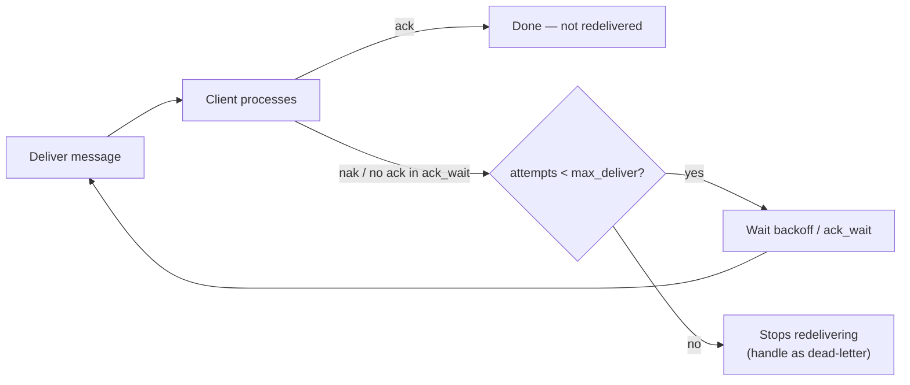

# JetStream Consumer Configuration

> Everything that shapes how a **consumer** reads a stream: where it starts (`deliver_policy`), how acks work (`ack_policy`, `ack_wait`, `max_deliver`, `backoff`), replay speed (`replay_policy`), subject filtering, and flow-control limits. The stream stores; the consumer decides *how you read.*

```bash
nats consumer add ORDERS billing \
  --pull --ack explicit --wait 30s --max-deliver 5 \
  --deliver all --replay instant \
  --filter "orders.us.>" --max-pending 1000
```

```typescript
import { jetstreamManager } from "@nats-io/jetstream";
import { DeliverPolicy, AckPolicy, ReplayPolicy } from "@nats-io/jetstream";
import { nanos } from "@nats-io/nats-core";

const jsm = await jetstreamManager(nc);
await jsm.consumers.add("ORDERS", {
  durable_name: "billing",
  deliver_policy: DeliverPolicy.All,   // all | last | new | by_start_sequence | by_start_time | last_per_subject
  ack_policy: AckPolicy.Explicit,      // explicit | all | none
  ack_wait: nanos(30 * 1000),          // nanoseconds
  max_deliver: 5,
  replay_policy: ReplayPolicy.Instant, // instant | original
  filter_subjects: ["orders.us.>"],
  max_ack_pending: 1000,
});
```

## Deliver policy — *where does a new consumer start reading?*

(default: `all`)

| Policy | Starts at |
|--------|-----------|
| `all` | the very first message in the stream |
| `last` | the last message only, then new ones |
| `new` | only messages published **after** the consumer is created |
| `last_per_subject` | the last message for **each** matching subject (great for "current state") |
| `by_start_sequence` | a specific stream sequence (`opt_start_seq`) |
| `by_start_time` | a specific timestamp (`opt_start_time`) |

This only decides the **starting point** for a fresh consumer. A durable consumer then tracks its own position from there.

## Ack policy & redelivery — *the at-least-once machinery*

- **`ack_policy`** (default `explicit`):
  - `explicit` — every message must be acked individually (required for work queues / most real use).
  - `all` — acking sequence N acks everything up to N.
  - `none` — no acks; fire-and-forget over stored data.
- **`ack_wait`** — how long the server waits for an ack before **redelivering** (default ~30s).
- **`max_deliver`** — max delivery attempts before giving up (default -1 = unlimited). Pair with a dead-letter pattern.
- **`backoff`** (2.7.1) — an array of delays overriding `ack_wait` per redelivery attempt, e.g. `[1s, 5s, 30s]` for exponential-style retry.



**Ack types the client sends:** `ack` (done), `nak` (redeliver, optional delay), `term` (stop redelivering — poison message), `working`/in-progress (extend `ack_wait` for a long job).

## Replay policy

(default: `instant`) — `instant` delivers stored messages as fast as possible; `original` re-delivers them preserving the **original inter-message timing** (useful for simulations/replays).

## Subject filtering

- `filter_subject` — a single subject filter narrowing which of the stream's subjects this consumer sees.
- `filter_subjects` (2.10) — **multiple** filters (a set of overlapping subjects), so one consumer can select several specific subjects without taking the whole stream.

## Flow control & limits

| Option | Meaning | Default |
|--------|---------|---------|
| `max_ack_pending` | max un-acked messages in flight before the server **pauses** delivery — the primary flow-control lever | 1000 |
| `inactive_threshold` | auto-delete the (ephemeral) consumer after this idle duration | none |
| `rate_limit` | throttle delivery in bits/sec | none |
| `sample_freq` | % of acks to sample for monitoring | none |
| `headers_only` (2.6.2) | deliver headers + size only, not the body | false |
| `num_replicas` (2.8.3) | replicas for the consumer's own state (0 = inherit stream) | 0 |
| `mem_storage` (2.8.3) | keep consumer state in memory even on a file stream | false |

<details markdown="1">
<summary>Deeper dive — pull vs push options, max_ack_pending as back-pressure, ordered consumers</summary>

**Pull consumer limits** (recommended for new work — explicit back-pressure):

- `max_waiting` — max concurrent outstanding pull requests.
- `max_request_batch` (2.7) — cap the batch size a single pull can ask for.
- `max_request_expires` (2.7) — cap how long a pull request can wait.
- `max_request_max_bytes` (2.8.3) — cap total bytes per pull batch.

Consume/fetch in nats.js v3:

```typescript
const c = await js.consumers.get("ORDERS", "billing");
const msgs = await c.consume({ max_messages: 100 }); // continuous
for await (const m of msgs) { await handle(m); m.ack(); }
// or a bounded pull:
const batch = await c.fetch({ max_messages: 10, expires: 5000 });
```

**Push consumer options** (server pushes to a subject; flow-controlled):

- `deliver_subject` — the subject the server pushes to (its presence makes a consumer "push").
- `deliver_group` — a queue group so multiple subscribers share the push stream.
- `flow_control` + `idle_heartbeat` — sliding-window flow control and liveness heartbeats.

**`max_ack_pending` is the real throttle.** With `explicit` acks, once this many messages are delivered-but-un-acked, the server stops sending more until you ack. Set it to bound memory/parallelism; too low starves throughput, too high risks overload.

**Ordered consumers** (client convenience): an ephemeral, single-threaded, auto-recreating push consumer that guarantees in-order delivery with no acks — ideal for a simple "replay this stream to me" reader.

</details>

## Gotchas

- **Durations are nanoseconds** (`ack_wait`, `opt_start_time` is a timestamp). Use `nanos()`.
- **Forgetting to ack ≠ data loss — it's redelivery.** After `ack_wait`, un-acked messages come back, which looks like duplicates. Use `term()` for genuinely bad messages and set `max_deliver` + a dead-letter path.
- **`max_ack_pending` too low silently caps throughput** even when your app could go faster — a classic "why is my consumer slow?" trap.
- **Push consumers are legacy-leaning; prefer pull** for new services (better scaling and back-pressure).
- **Ephemeral consumers vanish** (`inactive_threshold`); use `durable_name` to persist position across restarts.

## Related

- [JetStream](jetstream.md) — streams/consumers model and acks overview
- [Stream configuration](stream-config.md) — the write-side counterpart (retention/limits/discard)

## References

- [Consumers — configuration](https://docs.nats.io/nats-concepts/jetstream/consumers)
- [Consumer details](https://docs.nats.io/using-nats/developer/develop_jetstream/consumers)
- [nats.js — JetStream README](https://github.com/nats-io/nats.js/blob/main/jetstream/README.md)
