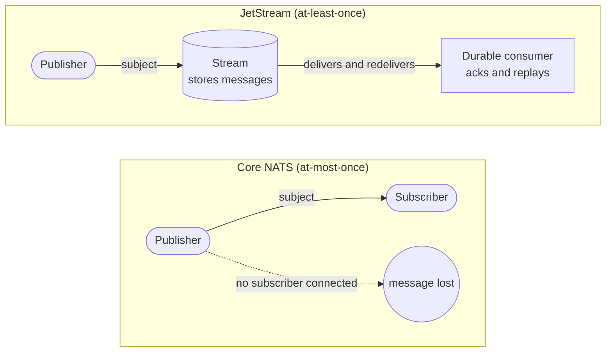

# NATS

> A high-performance, open-source messaging system built around **subjects** (hierarchical topics). One lightweight server binary gives you pub/sub, request-reply, and load-balanced queues; **JetStream** adds persistence, replay, and stronger delivery guarantees on top.

## What NATS is

NATS is a "connective technology" for services, edge, and IoT — think of it as a nervous system where any client can address any other by **subject** without knowing where it lives. Key traits:

- **Single small binary** (`nats-server`), no external dependencies (unlike Kafka's ZooKeeper/KRaft or a JVM).
- **Subject-based addressing** with wildcards — publishers and subscribers are fully decoupled; there's no fixed "topic" object to create for core messaging.
- **Two layers:**
  - **[Core NATS](core-nats.md)** — fire-and-forget, in-memory routing, **at-most-once** delivery. Extremely fast, no persistence.
  - **[JetStream](jetstream.md)** — a persistence layer (streams + consumers) giving **at-least-once** and **exactly-once** (within a dedup window) delivery, replay, and stream storage. Built into the same server since NATS Server 2.2.

## The three core messaging patterns

| Pattern | Shape | Use |
|---------|-------|-----|
| **Publish-Subscribe** | 1 → N, every subscriber gets a copy | events, broadcasts |
| **Request-Reply** | 1 ↔ 1, requester awaits a response on a temporary "inbox" subject | RPC-style calls, service APIs |
| **Queue groups** | 1 → 1-of-N, server picks one member of the group at random | load-balancing / scaling a service horizontally |

All three are **core NATS** and covered in detail in [Core NATS](core-nats.md).

## Core vs JetStream — the key distinction

- **Core NATS** routes messages *now*. If a subscriber isn't connected, it never sees the message — that's at-most-once.
- **JetStream** *stores* messages in a **stream**, and **consumers** read from that store at their own pace, acking each one. Late subscribers can replay history.

## Delivery guarantees (interview staple)

| Layer | Guarantee | How |
|-------|-----------|-----|
| Core NATS | **At-most-once** | No storage, no acks — fast but lossy if no subscriber. |
| JetStream | **At-least-once** | Stream stores the message; consumer redelivers until acked. |
| JetStream | **Exactly-once** (within a window) | Publisher dedup via `Nats-Msg-Id` + consumer **double-ack**. |

## When to reach for NATS

- You want a **simple, low-latency** backbone for microservices (request-reply, events) without operating Kafka/RabbitMQ.
- You need both **ephemeral messaging** (core) and **durable streaming** (JetStream) from one system.
- Reach for **Kafka** instead when you need very high-throughput, long-retention log analytics with a large partitioned-log ecosystem; **RabbitMQ** for complex broker-side routing/AMQP semantics.

## Related

- [Core NATS](core-nats.md) — subjects, pub/sub, request-reply, queue groups
- [JetStream](jetstream.md) — streams, consumers, acks, retention, dedup
- [Stream configuration](stream-config.md) · [Consumer configuration](consumer-config.md) — the full option sets
- [KV store](kv-store.md) · [Object store](object-store.md) — higher-level stores on JetStream

## References

- [NATS Concepts — Overview](https://docs.nats.io/nats-concepts/overview)
- [What is NATS](https://docs.nats.io/nats-concepts/what-is-nats)
- [FAQ — delivery guarantees](https://docs.nats.io/reference/faq)
