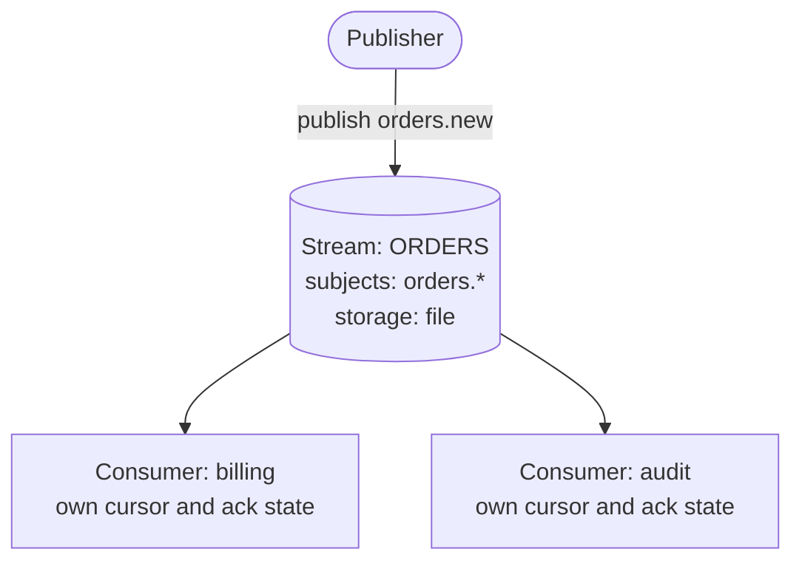

# NATS JetStream

> The persistence layer built into `nats-server`: **streams** store messages published to subjects, and **consumers** are stateful views that deliver and track acks — giving **at-least-once** and **exactly-once** (within a dedup window) delivery, plus replay and retention. Available since NATS Server 2.2.

## The model: streams and consumers

- A **stream** captures and stores messages for a set of subjects (e.g. `orders.>`). Storage is **file** or **memory**, with limits and a retention policy.
- A **consumer** is a *stateful cursor* over a stream. It tracks which messages have been delivered and acknowledged, and redelivers un-acked ones. Multiple consumers can read the same stream independently.



**Intuition:** the stream is the durable log; the consumer is *your* bookmark into it, with redelivery until you ack.

## Creating a stream and publishing

```bash
# create a stream that captures everything under orders.>
nats stream add ORDERS --subjects "orders.>" --storage file --retention limits

# publish into it (a normal publish on a captured subject is stored)
nats pub orders.new '{"id":1}'
```

```typescript
import { connect } from "@nats-io/transport-node";
import { jetstream, jetstreamManager } from "@nats-io/jetstream";

const nc = await connect({ servers: "localhost:4222" });

// management: define the stream
const jsm = await jetstreamManager(nc);
await jsm.streams.add({ name: "ORDERS", subjects: ["orders.>"] });

// JetStream publish returns an ack with the assigned stream sequence
const js = jetstream(nc);
const ack = await js.publish("orders.new", JSON.stringify({ id: 1 }));
console.log(ack.stream, ack.seq); // "ORDERS", 1
```

A **JetStream publish** waits for a `PubAck` confirming the message was persisted — unlike a core `publish`, which is fire-and-forget.

## Consuming with acks (pull consumer)

Modern JetStream favors **pull consumers** — the client asks for batches, which makes back-pressure and scaling explicit.

```bash
nats consumer add ORDERS billing --pull --ack explicit
nats consumer next ORDERS billing   # pull and (auto-)ack one message
```

```typescript
// create a durable consumer, then consume with explicit acks
await jsm.consumers.add("ORDERS", {
  durable_name: "billing",
  ack_policy: "explicit",
});

const consumer = await js.consumers.get("ORDERS", "billing");
const messages = await consumer.consume();   // continuous stream of messages
for await (const m of messages) {
  try {
    await process(m);
    m.ack();               // tell JetStream: done, don't redeliver
  } catch {
    m.nak();               // negative ack: redeliver later
  }
}
```

If you don't `ack()` within the consumer's `ack_wait`, JetStream **redelivers** — the basis of at-least-once.

## Acks, retention, delivery — the levers

<details>
<summary>Deeper dive — ack policies, ack types, retention, deliver/replay, dedup & exactly-once</summary>

**Ack policies** (how much acking is required):

| Policy | Meaning |
|--------|---------|
| `none` | no acks; fire-and-forget over stored data |
| `all` | acking message N acks all up to N |
| `explicit` | every message must be acked individually (required for most work-queue setups) |

**Ack types** the client can send: `ack` (done), `nak` (redeliver, optionally with delay), `term` (stop redelivering — poison message), `working`/in-progress (reset the ack timer for long jobs).

**Retention policies** (when stored messages are removed):

| Retention | Removes messages… |
|-----------|-------------------|
| `limits` (default) | only when a limit is hit — max messages, bytes, or age. Messages persist for replay. |
| `interest` | once **all** consumers with interest have acked them. |
| `workqueue` | as soon as **one** consumer acks — the stream acts as a distributed work queue (each message consumed once). |

**Deliver policy** (where a new consumer starts): `all`, `last`, `new`, `by_start_sequence`, `by_start_time`, `last_per_subject`. **Replay policy**: `instant` (as fast as possible) or `original` (preserve original timing).

**Deduplication & exactly-once.** Set a `Nats-Msg-Id` header on publish; within the stream's **duplicate window**, JetStream drops repeats — so publisher retries don't create duplicates:

```typescript
await js.publish("orders.new", payload, { msgID: "order-1" }); // dedup key
```

Combined with consumer **double-ack** (`m.ackAck()` — wait for the server to confirm it received your ack), this yields **exactly-once within the window**. Note it's bounded by the dedup window, not infinite.

**Push vs pull consumers.** Push consumers deliver automatically to a subject (flow-controlled); pull consumers let clients request batches on demand. Pull is now the recommended default — easier scaling and back-pressure. Multiple client instances binding the same durable pull consumer share the workload (like a queue group over durable data).

**Beyond streams.** JetStream also powers **KV store** (`@nats-io/kv`) and **Object store** (`@nats-io/obj`), both implemented as streams under the hood.

</details>

## Gotchas

- **Publishing to a subject not captured by any stream** just behaves like core NATS (not stored). The stream's `subjects` must match.
- **`workqueue` retention allows only one consumer to consume a given message** — adding a second overlapping consumer errors or splits work; don't use it when you need fan-out (use `limits`/`interest`).
- **Exactly-once is windowed**, not absolute: dedup only works inside the stream's duplicate window (`duplicate_window`). Retries after the window can duplicate.
- **Un-acked ≠ lost.** Forgetting to `ack()` doesn't drop messages — it causes **redelivery** after `ack_wait`, which can look like duplicates. Use `term()` for genuinely bad messages.
- **JetStream publish is slower than core** — it waits for a persistence ack. Don't use it where at-most-once core NATS suffices.
- Client-version note: examples are **nats.js v3** (`jetstream(nc)`); legacy **v2** used `nc.jetstream()` / `nc.jetstreamManager()`.

## Related

- [NATS overview](index.md) — core vs JetStream, delivery guarantees
- [Core NATS](core-nats.md) — the subjects and patterns JetStream stores on top of

## References

- [JetStream — concept overview](https://docs.nats.io/nats-concepts/jetstream)
- [Streams](https://docs.nats.io/nats-concepts/jetstream/streams)
- [Consumers](https://docs.nats.io/nats-concepts/jetstream/consumers)
- [JetStream model deep dive](https://docs.nats.io/using-nats/developer/develop_jetstream/model_deep_dive)
- [nats.js — JetStream README](https://github.com/nats-io/nats.js/blob/main/jetstream/README.md)
