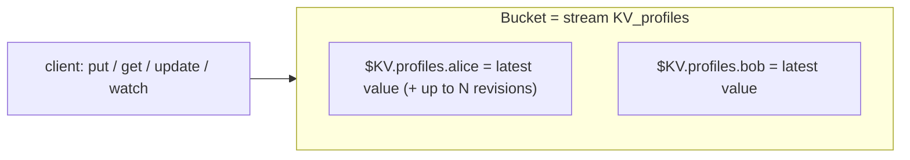

# JetStream KV Store

> An **immediately-consistent, persistent key/value store** built on JetStream. Put/get/delete keys, keep a bounded history per key, do atomic compare-and-set updates, and **watch** for changes in real time — all backed by a regular stream.

## What it is and how it's built

A KV **bucket** is just a JetStream stream named `KV_<bucket>`, where each key maps to a subject `$KV.<bucket>.<key>`. "Set a key" = publish to that subject; "get a key" = read the latest message on it; **history** = `max_msgs_per_subject`. Because it's a stream, KV inherits persistence, replication, and TTL for free.



Keys allow `a-z A-Z 0-9 _ - . = /`, so `.` gives you hierarchical keys (and wildcard watches).

## Bucket configuration

| Option | Meaning | Default |
|--------|---------|---------|
| `history` | revisions kept per key | 1 (**max 64**) |
| `ttl` | how long a value lives before expiring | none |
| `max_value_size` | cap on a single value's size | unlimited |
| `max_bytes` | cap on total bucket size | unlimited |
| `storage` | `file` or `memory` | file |
| `replicas` | replica count (cluster) | 1 |
| `compression` | s2 compression | off |

## Operations

```bash
nats kv add profiles --history 5 --ttl 24h
nats kv put profiles alice '{"tier":"pro"}'
nats kv get profiles alice
nats kv history profiles alice
nats kv del profiles alice
nats kv watch profiles
```

```typescript
import { Kvm } from "@nats-io/kv";

const kvm = new Kvm(js);                       // or new Kvm(nc)
const kv = await kvm.create("profiles", { history: 5 });
// const kv = await kvm.open("profiles");      // if it must already exist

await kv.put("alice", JSON.stringify({ tier: "pro" }));

const e = await kv.get("alice");               // KvEntry | null
console.log(e?.revision, e?.string());         // revision + value

// atomic create: fails if the key already exists
await kv.create("bob", "new");

// compare-and-set: only succeeds if alice is still at revision `e.revision`
await kv.update("alice", JSON.stringify({ tier: "enterprise" }), e.revision);

await kv.delete("alice");   // tombstone (history preserved)
await kv.purge("alice");    // drop all history, keep only the purge marker
```

A **`KvEntry`** carries `{ bucket, key, value, created, revision, delta, operation }` where `operation` is `PUT`, `DEL`, or `PURGE`.

## Revisions & optimistic concurrency

Every write bumps a monotonic **revision** (the stream sequence). This gives you lock-free concurrency:

- `create(key, val)` — succeeds **only if the key doesn't exist**.
- `update(key, val, expectedRevision)` — succeeds **only if the current revision matches**; otherwise it fails and you re-read and retry. That's compare-and-set (CAS).

```typescript
// safe read-modify-write loop
for (;;) {
  const cur = await kv.get("counter");
  const next = (Number(cur?.string() ?? "0") + 1).toString();
  try { await kv.update("counter", next, cur?.revision ?? 0); break; }
  catch { /* someone else won; retry */ }
}
```

<details markdown="1">
<summary>Deeper dive — watch, delete vs purge, consistency model, history limit</summary>

**Watch.** `kv.watch()` streams changes; it starts by replaying the **latest** value of each watched key, then live updates. You can watch a key subset (with wildcards) or everything, and it emits `PUT`/`DEL`/`PURGE` operations — ideal for caches and live config.

**Delete vs purge.**
- `delete` writes a **tombstone** (`DEL`) but keeps prior revisions in history.
- `purge` removes **all** history for the key, leaving only a `PURGE` marker (uses the stream's rollup header). Use purge to actually reclaim space / scrub a key.

**Consistency.** KV is *immediately* consistent for writes (monotonic revisions), but a value read via **direct get** may be served by a follower/mirror, so it doesn't guarantee strict "read-your-writes" in all cluster topologies. For single-server it's straightforward.

**History cap.** `history` maxes out at **64** per key. If you need more versions, model it as a plain [stream](stream-config.md) with a large `max_msgs_per_subject` instead of the KV abstraction.

**TTL.** Bucket `ttl` expires values by age (backed by the stream's `max_age`), so KV doubles as a persistent cache with expiry.

</details>

## Gotchas

- **`history` ≤ 64.** Asking for more silently isn't possible — use a stream directly.
- **`get` returns `null` for a missing/deleted key** — check it; a deleted key resolves to `null` (its last op was `DEL`).
- **`update` needs the *current* revision.** A stale revision fails by design — that's the CAS guarantee, so wrap it in a retry loop rather than treating the failure as an error.
- **It's a stream underneath.** Millions of hot keys = a large stream; size `max_bytes`/`history` deliberately.
- **Not strict read-your-writes** across replicas with direct get — don't assume a `put` is instantly visible from every node.

## Related

- [Stream configuration](stream-config.md) — KV is a stream with `max_msgs_per_subject` = history
- [Object store](object-store.md) — the sibling store for large files/blobs
- [JetStream](jetstream.md) — the persistence layer underneath

## References

- [Key/Value Store — concept](https://docs.nats.io/nats-concepts/jetstream/key-value-store)
- [Using the Key/Value Store](https://docs.nats.io/using-nats/developer/develop_jetstream/kv)
- [nats.js — KV README](https://github.com/nats-io/nats.js/blob/main/kv/README.md)
