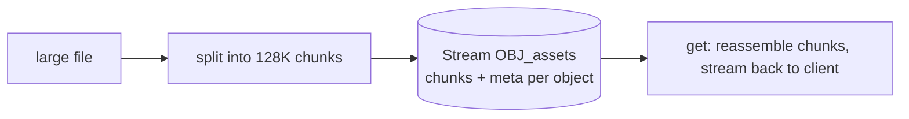

# JetStream Object Store

> A **file/blob store** built on JetStream: put and get objects of arbitrary size, streamed in **chunks**, with metadata, integrity digests, and change **watching** — backed by a regular stream.

## What it is and how it's built

An Object **bucket** is a JetStream stream named `OBJ_<bucket>`. Each object is split into fixed-size **chunks** (default **128 K**, configurable) published to a chunk subject, plus a **meta** message describing the object (name, size, digest, headers). This lets files larger than a single NATS message move safely over the infrastructure.



> ⚠️ It is **not** a distributed storage system — every object in a bucket must fit on the target server's file system. Think "S3-lite for config/artifacts over NATS," not a scale-out blob store.

## Bucket configuration

| Option | Meaning | Default |
|--------|---------|---------|
| `description` | human description | none |
| `ttl` | expire objects by age | none |
| `max_bytes` | cap total bucket size | unlimited |
| `storage` | `file` or `memory` | file |
| `replicas` | replica count (cluster) | 1 |
| `compression` | s2 compression | off |

## Operations

```bash
nats object add assets
nats object put assets ./report.pdf
nats object get assets report.pdf --output ./out.pdf
nats object ls assets
nats object info assets report.pdf
nats object del assets report.pdf
```

```typescript
import { Objm } from "@nats-io/obj";

const objm = new Objm(js);                 // or new Objm(nc)
const os = await objm.create("assets");    // or objm.open("assets")

// small in-memory blob
await os.putBlob({ name: "note.txt" }, new TextEncoder().encode("hello"));
const bytes = await os.getBlob("note.txt");  // Uint8Array | null

// large file: stream it in (Web ReadableStream / Node stream)
await os.put({ name: "report.pdf", meta: { headers } }, readableStream);

const info = await os.info("report.pdf");    // size, chunks, digest, mtime…
const list = await os.list();                // ObjectInfo[]
const status = await os.status();            // { bucket, size, ... }
await os.delete("report.pdf");               // removes chunks + meta
```

Each object's **info** includes its `size`, `chunks`, an `mtime`, and a **`digest`** (SHA-256) used to verify integrity on read.

<details markdown="1">
<summary>Deeper dive — chunking, digests, links, watch, delete semantics</summary>

**Chunking.** The default chunk size is 128 K; lower it (e.g. 32 K) on constrained links or when the server caps `max_payload`. `get`/`getBlob` reassembles chunks in order and streams them back.

**Integrity.** On `put`, the client computes a SHA-256 **digest** stored in the object meta; on `get` the digest is verified, so corruption/partial writes are detected.

**Links.** You can create a **link** — an object that points to another object (or another bucket), like a symlink — via `os.link(name, target)` / `addLink`, useful for aliasing "latest" to a versioned object.

**Watch.** `os.watch()` notifies on successful put/delete in the bucket (metadata changes), so you can react to new/updated artifacts.

**Delete reclaims chunks.** Deleting an object purges its chunk messages from the underlying stream (a rollup/purge), not just a tombstone — so space is actually reclaimed.

</details>

## KV vs Object store — which one?

| | [KV store](kv-store.md) | Object store |
|---|---|---|
| Value size | small (a `max_value_size`, fits one message) | large / arbitrary (chunked) |
| Semantics | key → latest value, revisions, CAS, history | named files/blobs with metadata + digest |
| Use for | config, feature flags, session/state, counters | artifacts, images, documents, backups |
| Concurrency | revision-based compare-and-set | whole-object put/get (no CAS) |

Rule of thumb: **small structured values → KV; whole files/binaries → Object store.**

## Gotchas

- **Not distributed storage.** A bucket's data must fit on the target file system — don't treat it as scalable blob storage; that's what real object stores (S3, etc.) are for.
- **`getBlob` loads the whole object into memory.** For large files use the streaming `put`/`get` APIs instead.
- **Whole-object writes, no partial update.** Updating an object replaces it (new revision of chunks); there's no in-place edit or CAS like KV.
- **Chunk size vs `max_payload`.** If chunk size exceeds the server's `max_payload`, puts fail — keep chunks ≤ the server limit.
- **`get`/`info` on a missing object returns null/errors** — check before use.

## Related

- [KV store](kv-store.md) — sibling store for small structured values
- [Stream configuration](stream-config.md) — the stream that backs the bucket
- [JetStream](jetstream.md) — the persistence layer underneath

## References

- [Object Store — concept](https://docs.nats.io/nats-concepts/jetstream/obj_store)
- [Using the Object Store](https://docs.nats.io/using-nats/developer/develop_jetstream/object)
- [nats.js — Object Store README](https://github.com/nats-io/nats.js/blob/main/obj/README.md)
