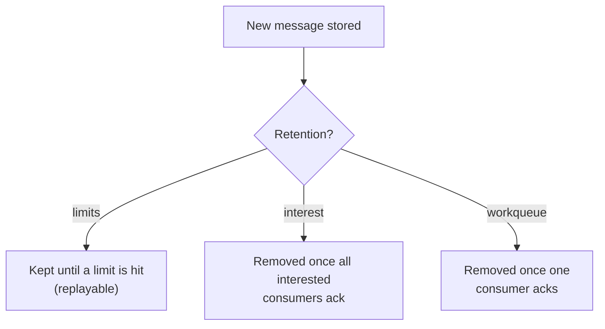

# JetStream Stream Configuration

> Everything that shapes how a **stream** stores messages: retention, discard, the size/age limits, storage, replication, and dedup. This is where you decide *what is kept, for how long, and what happens when limits are hit.*

Set these when you create/update a stream. Fields shown are the nats.js `StreamConfig` names; the CLI uses the same concepts as flags.

```bash
nats stream add ORDERS \
  --subjects "orders.>" \
  --retention limits --discard old \
  --max-msgs 1000000 --max-bytes 1GB --max-age 24h \
  --max-msg-size 1MB --max-msgs-per-subject 100 \
  --storage file --replicas 3 --dupe-window 2m
```

```typescript
import { jetstreamManager } from "@nats-io/jetstream";
import { RetentionPolicy, DiscardPolicy, StorageType } from "@nats-io/jetstream";
import { nanos } from "@nats-io/nats-core";

const jsm = await jetstreamManager(nc);
await jsm.streams.add({
  name: "ORDERS",
  subjects: ["orders.>"],
  retention: RetentionPolicy.Limits,   // limits | interest | workqueue
  discard: DiscardPolicy.Old,          // old | new
  max_msgs: 1_000_000,
  max_bytes: 1024 * 1024 * 1024,       // 1 GiB
  max_age: nanos(24 * 60 * 60 * 1000), // durations are NANOSECONDS
  max_msg_size: 1024 * 1024,
  max_msgs_per_subject: 100,
  storage: StorageType.File,           // file | memory
  num_replicas: 3,                     // 1..5
  duplicate_window: nanos(2 * 60 * 1000),
});
```

## Retention policy — *when is a message eligible for removal?*

The single most important choice. (default: `limits`)

| Policy | A message is removed when… | Use for |
|--------|----------------------------|---------|
| `limits` | a configured **limit** is hit (max msgs/bytes/age…). Otherwise it stays — even after every consumer acked it. | event logs, replayable history, audit |
| `interest` | **all** consumers that had interest at publish time have acked it. | fan-out where you only keep what's still needed |
| `workqueue` | **one** consumer acks it (each message consumed exactly once). | distributed job/task queue |



!!! warning "workqueue trap"
    Under `workqueue`, a given message can be delivered to only **one** consumer. You cannot have two overlapping consumers fan-out the same subject — the second add errors or splits the subject space. Need fan-out? Use `limits` or `interest`.

## Discard policy — *what happens when a limit is reached?*

(default: `old`) Applies to `max_msgs` / `max_bytes` (and per-subject via `discard_new_per_subject`).

- `old` — drop the **oldest** messages to make room. New writes always succeed (lossy at the tail).
- `new` — **reject** new writes once full; the publish gets an error. Preserves existing data; back-pressures the publisher.
- `discard_new_per_subject` (2.10) — apply `new` semantics per subject; requires `max_msgs_per_subject`.

## Limits — the caps that drive `limits` retention

| Option | Meaning | Default |
|--------|---------|---------|
| `max_msgs` | max message count in the stream | -1 (unlimited) |
| `max_bytes` | max total bytes stored | -1 |
| `max_age` | max age of any message (**nanoseconds**) | 0 (no age limit) |
| `max_msgs_per_subject` | per-subject message cap (e.g. keep last N per key) | -1 |
| `max_msg_size` | largest single message accepted | -1 |
| `max_consumers` | max consumers allowed on the stream | -1 |

`max_msgs_per_subject = 1` is the trick behind "keep only the latest value per subject" (and how the [KV store](kv-store.md) keeps history).

## Storage, replication, dedup

- **`storage`**: `file` (default, durable) or `memory` (fast, lost on restart).
- **`num_replicas`**: 1–5. In a cluster, 3 gives quorum-based fault tolerance (RAFT).
- **`duplicate_window`**: sliding window (nanoseconds) during which a repeated `Nats-Msg-Id` is deduplicated — the basis of exactly-once publishing. Larger window = more dedup memory.

<details markdown="1">
<summary>Deeper dive — mirrors/sources, republish, transforms, direct get, compression, governance, TTLs</summary>

**Replication topologies**

- `mirror` (2.2) — the stream is a read-only copy of another stream (clients can't publish to it directly).
- `sources` (2.2) — aggregate one or more upstream streams into this one; clients can still publish locally.
- `allow_direct` (2.9) / `mirror_direct` (2.9) — allow fast "direct get" of a message by sequence/subject served by any replica or mirror (used heavily by KV/Object for low-latency reads).

**Message routing / shaping**

- `republish` (2.8.3) — automatically re-publish each stored message to another subject (e.g. to bridge into core NATS).
- `subject_transform` (2.10) — rewrite a message's subject before storing.
- `compression` (**2.10**) — `s2` (Snappy) compression for file storage; trades CPU for disk.

**Governance / safety**

- `deny_delete`, `deny_purge` (2.6.2) — block the delete/purge APIs.
- `sealed` (2.6.2) — make the stream append-only-then-frozen; **irreversible**.
- `no_ack` (2.2) — disable publish acks (rarely used; e.g. pure request/reply over a stream).
- `allow_rollup_hdrs` (2.6.2) — allow the `Nats-Rollup` header to purge prior messages (used by KV `put`/purge).

**TTL & placement**

- `allow_msg_ttl` + `subject_delete_marker_ttl` (2.11) — per-message TTLs.
- `placement` — pin the stream to a cluster/tag.
- `metadata` (2.10) — arbitrary app key/value labels on the stream.

</details>

## Gotchas

- **Durations are nanoseconds** in the config (`max_age`, `duplicate_window`). Use the client's `nanos()` helper; passing milliseconds silently means a near-zero window.
- **`limits` retention keeps acked messages.** Consuming a message does *not* delete it under `limits` — only the limits do. Interviewers love this: "I acked everything, why is the stream still full?"
- **`discard: new` errors the publisher** when full — handle the rejected `PubAck`. With `old`, you instead silently lose the oldest data.
- **Shrinking limits doesn't instantly reclaim** to the exact new value at all times; enforcement is continuous but think in terms of eventual trimming.
- **`num_replicas` only matters in a cluster**; a single server ignores >1.

## Related

- [JetStream](jetstream.md) — the streams/consumers model these options configure
- [Consumer configuration](consumer-config.md) — the read-side counterpart (deliver/ack/replay)
- [KV store](kv-store.md) · [Object store](object-store.md) — higher-level stores built on streams

## References

- [Streams — configuration](https://docs.nats.io/nats-concepts/jetstream/streams)
- [JetStream model deep dive (retention)](https://docs.nats.io/using-nats/developer/develop_jetstream/model_deep_dive)
- [nats.js — JetStream README](https://github.com/nats-io/nats.js/blob/main/jetstream/README.md)
