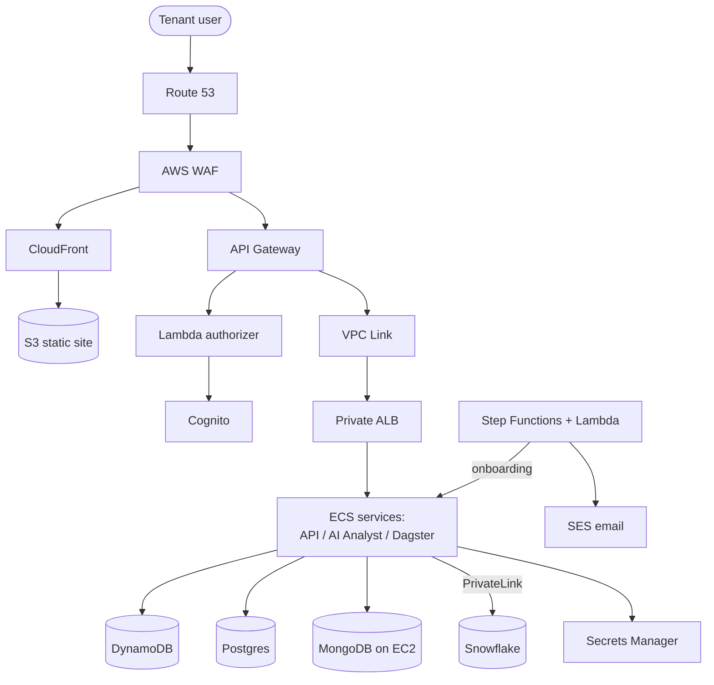

# AWS Architecture — Component by Component

> Every service in the AXIS IQ AWS diagram, grouped by layer: **what it is, why it's here, and the key configuration steps**. For the tenancy model and the AWS↔Azure map, see the [overview](index.md). For the Azure rebuild, see the [Azure note](azure-architecture.md).

The workload spans **three AWS accounts**:

| Account | Role |
|---|---|
| `acc-portfolio-dev` | Main workload — DNS, edge, API, auth, VPC, ECS, data stores, secrets, onboarding |
| `acc-shared-service-dev` | Shared registries — S3 infra registry (Terraform), S3 package registry (dbt/Power BI artifacts) |
| `accordion-clients` / partners | Client deployment repos + shared services referenced cross-account |

Using separate accounts is a deliberate **blast-radius / billing / IAM boundary** — a core AWS multi-account best practice (AWS Organizations + Control Tower).

---

## 1. DNS & networking

### Route 53 (hosted zones + records)
**What:** AWS's managed DNS. The diagram has a **public hosted zone** (`dev.accordionintelligence.com`) and **private hosted zones** (e.g. `internal-dev.accordionintelligence.com`, `dagster_grpc_clients`) resolvable only inside the VPC.

**Why:** Public zones map tenant URLs (`northbeam-data-platform.dev...`, `data-platform-api.dev...`, `...-orchestration.dev...`) to the edge. Private zones give **internal service-to-service DNS** (e.g. `api-service.internal-dev...`, `northbeam-web.dagster_grpc_clients:80`) without exposing anything publicly. Per-tenant records are created during onboarding.

**How to configure:**
- Create a **public hosted zone** for the parent domain; add **A/AAAA alias** records to CloudFront (web) and to the API Gateway custom domain (API).
- Create **private hosted zones** and **associate them with the VPC**; records point to internal ALBs / Cloud Map names.
- Use **alias records** (free, health-aware) to AWS resources rather than CNAMEs at the apex.

Public vs private hosted zone — the interview distinction

A **private hosted zone** only answers queries from VPCs you associate it with (requires `enableDnsHostnames` + `enableDnsSupport` on the VPC). It's how you get pretty internal names like `api-service.internal-dev...` that never leak to public DNS. A **public hosted zone** is authoritative on the internet. Same domain can have both (split-horizon DNS).

### VPC, subnets, ALB
**What:** The isolated network. **Public subnets** hold the internet-facing **Application Load Balancer**; **private subnets** hold ECS tasks, databases, and an **internal ALB** (`dp-alb-private-dev-uw2`).

**Why:** Standard security posture — nothing with data sits in a public subnet. The public ALB / API Gateway terminate ingress; everything else is private and reached over the VPC.

**How to configure:** VPC with public + private subnets across ≥2 AZs; **NAT gateway** for private-subnet egress; **security groups** as the primary firewall (ALB SG → ECS SG → DB SG, least privilege); **internal ALB** (scheme `internal`) for east-west traffic.

### API Gateway VPC Link
**What:** A private integration that lets **API Gateway** (which lives at the AWS edge, outside your VPC) forward requests to a **private** ALB/NLB inside the VPC.

**Why:** The API backend runs on private ECS tasks. VPC Link is the bridge so you never expose the backend publicly while still using API Gateway's throttling/auth/features.

**How to configure:** Create a **VPC Link** (for HTTP APIs it targets an ALB/NLB; for REST APIs, an NLB). Point a private integration at it. The `dp-vpc-link-uw2` in the diagram fronts the private ALB.

### AWS Cloud Map (`dagster-grpc-clients`)
**What:** Service **discovery** — a registry mapping logical service names to instances, integrated with Route 53.

**Why:** Dagster's components (webserver, daemon, gRPC user-code servers) must find each other. Cloud Map gives stable names like `northbeam.dagster_grpc_clients:4000` regardless of task IP churn.

**How to configure:** Create a Cloud Map **namespace** (private DNS namespace tied to the VPC); ECS **Service Discovery** registers tasks automatically; consumers resolve the name.

Cloud Map vs ECS Service Connect — both appear in the diagram

- **Cloud Map / Service Discovery** = DNS-based: you get an A/SRV record per task; the *client* load-balances.
- **ECS Service Connect** (the "ECS Service Connect — Client/Server" boxes) = a newer, proxy-based mesh: ECS injects an Envoy sidecar, gives you a logical endpoint, retries, and telemetry, without you managing DNS TTLs. The platform uses Service Connect for tenant Dagster east-west traffic and Cloud Map for gRPC client discovery. Interviewers love this: **Service Connect is the modern default for ECS-to-ECS**; Cloud Map still underpins it and is used directly for non-HTTP/gRPC cases.

### VPC PrivateLink → Snowflake
**What:** A private, AWS-backbone connection to Snowflake (interface VPC endpoint), marked **TBD** in the diagram.

**Why:** dbt transformations hit Snowflake constantly. PrivateLink keeps that traffic off the public internet and lets you `deny` public access on the Snowflake side.

**How to configure:** Snowflake enables `SYSTEM$AUTHORIZE_PRIVATELINK`; you create an **interface VPC endpoint** to the Snowflake service, plus a Route 53 private zone so the Snowflake URL resolves to the endpoint's private IP.

---

## 2. Edge & security

### AWS WAF (`data-platform-web-waf`, `data-platform-uw2-api-waf`, TBD)
**What:** A web application firewall attached to CloudFront (web) and API Gateway (API).

**Why:** First line of defense — blocks SQLi/XSS, applies rate limiting, geo/IP rules, and AWS **managed rule groups** before traffic reaches the app. Separate web-ACLs for the web edge vs the API edge let you tune rules per surface.

**How to configure:** Create a **Web ACL**, add managed rule groups (Core, Known Bad Inputs, rate-based rule), set default action `Allow`, associate with the CloudFront distribution / API Gateway stage. (CloudFront-scope WAF must be in `us-east-1`.)

### AWS Certificate Manager (ACM)
**What:** Free, auto-renewing public TLS certificates (`dev.accordionintelligence.com`).

**Why:** HTTPS everywhere. ACM issues and rotates certs so you never hand-manage PEM files.

**How to configure:** Request a cert (DNS validation via a Route 53 CNAME), attach to CloudFront / ALB / API Gateway custom domain. **Gotcha:** CloudFront certs must be issued in **`us-east-1`** regardless of where the app runs.

### CloudFront (CDN) + S3 static hosting (`dp-web-hosting-dev-uw2`)
**What:** CloudFront is the global CDN; the **S3 bucket** stores the built SPA (static web app). CloudFront serves it at the edge.

**Why:** Fast global delivery, TLS termination, WAF attachment, and origin shielding for the static frontend. S3 is cheap, durable object storage — ideal for a static site.

**How to configure:** Upload the built site to S3 (block public access **on**); create a CloudFront distribution with an **Origin Access Control (OAC)** so only CloudFront can read the bucket; set default root object `index.html` and an SPA error-routing rule (403/404 → `/index.html`); attach ACM cert + WAF.

---

## 3. API & authentication

### API Gateway (`dp-api-gateway-dev-uw2`)
**What:** The managed front door for the REST/HTTP API.

**Why:** Centralizes TLS, throttling, request validation, custom domains, and (crucially) **authorization** before requests reach ECS via the VPC Link. Multi-tenant APIs benefit from its per-stage throttling and usage plans.

**How to configure:** Define routes/methods; attach a **custom domain** (ACM cert) mapped in Route 53; wire a **VPC Link** private integration to the private ALB; attach the **Lambda authorizer**; attach the API WAF.

### Lambda authorizer (`tenant-authorizer`)
**What:** A Lambda that API Gateway calls to authorize each request — it validates the caller's token/cookie and resolves **which tenant** they belong to.

**Why:** In multi-tenant SaaS, every request must be scoped to a tenant. The authorizer validates the Cognito JWT (or the Dagster **authorization cookie** carrying `TenantId & Auth Token`) and returns an IAM policy + tenant context. Centralizing this keeps tenant-isolation logic in one place.

**How to configure:** Create a **REQUEST or TOKEN Lambda authorizer**; it verifies the JWT signature against the Cognito user-pool JWKS, extracts claims, and returns `{ principalId, policyDocument, context: { tenantId } }`. Enable **authorizer result caching** keyed on the token to cut latency/cost.

### Amazon Cognito user pool (`dp-northbeam-dev-uw2`)
**What:** Managed customer identity (CIAM) — user directory, sign-up/sign-in, MFA, hosted UI, OAuth2/OIDC token issuance.

**Why:** Handles authentication so the app doesn't store passwords. Issues JWTs the Lambda authorizer validates. The pool name is per-tenant-ish (`dp-northbeam-...`), reflecting tenant separation at the identity layer.

**How to configure:** Create a **user pool**; add an **app client** (with the OAuth flows/scopes you need); configure a domain for the hosted UI; define password policy + MFA; on tenant onboarding, seed users and email invitations (see SES below).

---

## 4. Compute & orchestration

### ECS clusters, services, tasks
**What:** **Elastic Container Service** runs the platform's containers on **Fargate** (serverless containers). Two clusters: **Core Infra** (`dp-cluster-dev-uw2` — API, AI Analyst) and **Clients** (`dp-clients-dev-uw2` — per-tenant Dagster stacks).

**Why:** Container orchestration without managing servers. **Task** = a running set of containers from a task definition; **Service** = keeps N tasks healthy behind a load balancer and handles rolling deploys. Splitting core vs client clusters isolates tenant workloads.

**How to configure:** Register **task definitions** (image from ECR, CPU/mem, env, secrets from Secrets Manager, log config → CloudWatch, task role for AWS API access); create **services** with desired count, an ALB target group, and **Service Connect** enabled; use Fargate + private subnets.

### ECS Service Connect (Client / Server)
**What:** ECS's built-in service mesh for service-to-service calls (see the Cloud Map deep-dive above).

**Why:** Gives Dagster components stable logical endpoints, retries, and metrics without a separate mesh install.

**How to configure:** Enable Service Connect on the ECS **namespace** and per service; declare a `portName`/`discoveryName`; other services call the logical name.

### The Dagster orchestration stack (per tenant)
Dagster is the **data orchestrator** — it schedules and materializes data assets (running dbt). Each tenant gets a full stack:

| Component | Service | Role |
|---|---|---|
| **Webserver** | `northbeam-dagster-webserver` | The Dagster UI / GraphQL API |
| **Daemon** | `northbeam-dagster-daemon` | Runs schedules, sensors, run queue |
| **User code (gRPC)** | `northbeam-dagster-grpc-code` | Loads the tenant's dbt project; executes runs |
| **NGINX** | `northbeam-dagster-nginx` | Reverse proxy / auth-cookie gateway in front of the webserver |
| **Postgres** | `dp-northbeam-dagster-...-cluster` | Dagster's run/event/schedule storage |

**Why this shape:** Dagster's reference deployment separates the long-running daemon, the stateless webserver, and **user code** in its own gRPC server so tenant code can be **redeployed independently** and crash-isolated from the control plane. The **authorization cookie** (`TenantId & Auth Token`) flows through NGINX so only the right tenant can reach their Dagster.

**How to configure:** Run each as an ECS service; point `DAGSTER_PG_*` at the tenant Postgres; register user-code gRPC servers via a `workspace.yaml` using Cloud Map / Service Connect names (`northbeam.dagster_grpc_clients:4000`); the daemon and webserver connect to user-code over gRPC.

### EC2 + Auto Scaling Group — MongoDB (`mongodb-asg`) + EBS
**What:** A **self-managed MongoDB** on EC2 instances in an Auto Scaling Group, with **EBS** volumes for storage.

**Why:** There's no first-party managed MongoDB on AWS (DocumentDB is API-compatible but not identical), so the team runs Mongo on EC2. The ASG provides instance health/replacement; EBS gives durable block storage that survives instance replacement.

**How to configure:** Launch template with the Mongo AMI/user-data; ASG across AZs for the replica set; **EBS** volumes (gp3) attached per node; KMS-encrypted; backups via EBS snapshots.

---

## 5. Data stores

### DynamoDB (`dp-tenants-auth-dev-uw2`)
**What:** Managed serverless key-value/document NoSQL store.

**Why:** Holds tenant auth/session/lookup data needing single-digit-ms access at any scale. The authorizer's hot path (tenant lookup) suits DynamoDB's key-value access pattern.

**How to configure:** Table with a partition key (e.g. `tenantId`), **on-demand** capacity, encryption at rest (KMS), optional TTL for sessions, PITR backups.

### Postgres / Aurora (`dp-dev-cluster`)
**What:** Relational database (RDS/Aurora PostgreSQL). One core cluster plus per-tenant Dagster metadata clusters.

**Why:** Transactional, relational workloads — core platform state and Dagster's run/event log (Dagster requires Postgres in production).

**How to configure:** Aurora PostgreSQL cluster in private subnets; credentials in Secrets Manager (with rotation); encryption via **KMS** (`/dp/postgres`); Multi-AZ for HA.

### MongoDB
Document store for flexible/semi-structured data (see EC2 section above).

### Snowflake (external — `ACCORDION_ORG` → `AXISIQ_NORTHBEAM`)
**What:** The cloud **data warehouse**. An **org account** provisions a **per-tenant account** with **RAW / DEV / PROD** databases.

**Why:** Snowflake separates storage/compute, scales elastically, and its per-tenant *account* model gives strong data isolation. RAW (landed by Fivetran) → DEV (dbt dev) → PROD (published) is a classic medallion-style promotion.

**How to configure:** Org-level `CREATE ACCOUNT`; per tenant create RAW/DEV/PROD DBs, warehouses, roles; connect via **PrivateLink**; dbt targets DEV/PROD; keypair auth stored in Secrets Manager (the RSA public/private secrets in the diagram).

---

## 6. Secrets, config & encryption

### AWS Secrets Manager
**What:** Encrypted secret store. The diagram shows two workflows:
- **Tenant Onboarding — Management** (shared): `dp/dev/tenant/onboarding/snowflake/creds`, plus an **RSA public/private keypair** for Snowflake keypair auth.
- **Tenant Deployment** (per tenant, `dp/dev/tenants/[tenantid]/...`): `snowflake/api`, `fivetran/api`, `postgres/api`, `redis/api`, `mongodb/api`, `powerbi/api`, `clientapp/data/aurora/auth`, plus `system-managed/api` variants.

**Why:** Every downstream system (Snowflake, Fivetran, Power BI, DBs) needs credentials; storing them per-tenant under a namespaced path enforces isolation and lets ECS inject them at runtime. The **naming convention** (`dp/dev/tenants/[tenantid]/<system>/api`) is the tenant-isolation contract.

**How to configure:** Create secrets per path; grant task roles `secretsmanager:GetSecretValue` **scoped by resource ARN prefix** (so tenant A's role can't read tenant B); reference them in ECS task defs as `secrets:`; enable **rotation** (Lambda) for DB creds.

### SSM Parameter Store ("System Parameters")
**What:** Hierarchical config/parameter store (plaintext + KMS-encrypted `SecureString`).

**Why:** Non-secret config (feature flags, endpoints, versions) separate from true secrets — cheaper and versioned.

**How to configure:** Store params under a hierarchy (`/dp/dev/...`); ECS/Lambda read at boot; use `SecureString` (KMS) for sensitive values.

### AWS KMS (`/dp/postgres`)
**What:** Managed encryption-key service.

**Why:** Central key management + audit for encryption at rest across S3, EBS, RDS/Aurora, DynamoDB, Secrets Manager.

**How to configure:** Create **customer-managed keys (CMKs)** per domain (e.g. one for Postgres); key policies grant only the needed roles; enable automatic annual rotation.

---

## 7. Automation, onboarding & notifications

### Step Functions + Lambda (Tenant Onboarding)
**What:** A **Step Functions** state machine orchestrating **Lambda** steps to onboard a tenant end-to-end.

**Why:** Onboarding is a long, multi-step, failure-prone workflow (create Snowflake account, generate keypair, write secrets, create DNS records, deploy the Dagster stack, create the Cognito pool, send the invite). Step Functions gives durable execution, retries, error handling, and visibility — far better than one giant Lambda.

**How to configure:** Define the state machine (Task states → Lambdas, `Retry`/`Catch`, `Map` for fan-out); grant the execution role least-privilege access to each service; trigger it from the onboarding API/console.

### SES + Lambda (`dp-dev-email-invitation`)
**What:** **Simple Email Service** sends transactional email; a Lambda composes the tenant invitation email.

**Why:** Onboarding and Cognito flows need to email users (invites, verification). SES is the scalable, deliverability-managed sender.

**How to configure:** Verify the sending **domain** (DKIM + SPF DNS records), move out of the SES sandbox for production, send via API/SMTP from the Lambda; wire Cognito's email to SES.

---

## 8. CI/CD, registries & source

### Amazon ECR (`dp-clients-...`, `dp-repo-...`)
**What:** Private **container registry** for the platform's Docker images (client + server images).

**Why:** ECS pulls task images from ECR; keeping images private with scan-on-push is standard supply-chain hygiene.

**How to configure:** Create repos; enable **scan on push** + lifecycle policies (expire old tags); ECS task execution role gets `ecr:GetDownloadUrlForLayer` etc.; CI pushes tagged images.

### S3 Infra Registry & Package Registry (`acc-shared-service-dev`)
**What:** Two S3 buckets — **Infra Registry** holds **Terraform** artifacts/state for tenant environments; **Package Registry** holds published **dbt models & scripts** and **Power BI** report definitions.

**Why:** Decouples *building* packages (in GitHub CI) from *deploying* them. Tenant deployments pull versioned dbt/Power BI artifacts from the package registry; Terraform state for each tenant lives in the infra registry.

**How to configure:** Versioned, encrypted S3 buckets; Terraform **S3 backend** (+ DynamoDB lock table) for state; CI publishes package artifacts; deployments read pinned versions.

### GitHub (`accordion-partners`, `accordion-clients`)
**What:** Source of truth. `accordion-packages` publishes common dbt packages (`netsuite-adapter`, `finance-cdm`) and the Power BI repo (`power-bi-finance`); `accordion-clients` holds per-tenant deployment repos (`data-platform-northbeam`) with **App Code** (dbt common packages, `config.yml`, override/custom models) and **versioned Infra Code**.

**Why:** GitOps — every tenant's app + infra is versioned code. CI builds packages → S3 package registry; infra code + Terraform → the tenant deployment.

**How to configure:** GitHub Actions build/test/publish; OIDC federation to assume AWS roles (no long-lived keys); publish to ECR + S3 registries.

---

## 9. Data integration & BI

### Fivetran (external)
**What:** Managed **ELT replication**. Connectors pull each source system into Snowflake RAW; a "destination" defines the Snowflake target.

**Why:** Buying connectors (NetSuite, Salesforce, Sage Intacct, HubSpot, Meta/Google/LinkedIn/Bing Ads, GA4) beats building/maintaining dozens of extractors. Fivetran handles schema drift, incremental syncs, retries.

**How to configure:** Create connectors (source auth), point them at the tenant's Snowflake destination (creds from Secrets Manager `fivetran/api`), set sync frequency. Dagster can trigger/monitor Fivetran syncs as assets.

### dbt (runs inside Dagster user-code)
**What:** SQL-based transformation framework. dbt models turn RAW → curated marts in Snowflake.

**Why:** Version-controlled, tested, documented transformations. Common packages (`netsuite-adapter`, `finance-cdm`) standardize models; tenants add override/custom models.

**How to configure:** dbt project in the tenant repo; profiles target Snowflake DEV/PROD; Dagster's `dagster-dbt` integration materializes models as assets ("Perform Transformations" in the diagram).

### Power BI (Azure — embedded)
**What:** Reporting layer. Power BI **workspace** + **embedded** reports surfaced inside the app.

**Why:** Rich, interactive analytics over Snowflake PROD without building charts from scratch. Embedding keeps users in AXIS IQ. (Power BI is a Microsoft product — this is the multi-cloud seam; see the [Azure note](azure-architecture.md).)

**How to configure:** Azure App Registration/Service Principal for IaC; create the workspace; **assign it to embedded capacity**; connect datasets to Snowflake; app requests embed tokens (creds in Secrets Manager `powerbi/api`).

---

## Gotchas & interview traps

- **Shared vs per-tenant:** DNS, WAF, CDN, API Gateway, Cognito app clients, and the Dagster stack are per-tenant; the org Snowflake account, registries, and onboarding automation are shared. Be able to justify each.
- **Two service-discovery mechanisms:** Cloud Map (DNS) *and* Service Connect (proxy mesh) coexist — know why (see §1).
- **CloudFront/WAF/ACM must be in `us-east-1`** even if the app runs in `us-west-2` (`uw2` in the names).
- **Secrets namespacing = isolation boundary:** IAM policies scoped to `dp/dev/tenants/[tenantid]/*` are what actually prevent cross-tenant secret access.
- **Dagster's 3-plane split** (webserver / daemon / user-code gRPC) is a deliberate isolation + independent-deploy pattern, not accidental complexity.
- **Snowflake keypair auth** (RSA public/private in Secrets Manager) is preferred over passwords for service accounts.
- **VPC Link exists because API Gateway is outside your VPC** — a very common "how does the edge reach a private backend?" question.

## Related

- [Overview & tenancy model](index.md)
- [Azure re-architecture](azure-architecture.md)

## References

- [Amazon Route 53 — hosted zones](https://docs.aws.amazon.com/Route53/latest/DeveloperGuide/hosted-zones-working-with.html)
- [API Gateway — VPC links](https://docs.aws.amazon.com/apigateway/latest/developerguide/http-api-vpc-links.html)
- [AWS Cloud Map + ECS service discovery](https://docs.aws.amazon.com/AmazonECS/latest/developerguide/service-discovery.html)
- [ECS Service Connect](https://docs.aws.amazon.com/AmazonECS/latest/developerguide/service-connect.html)
- [AWS WAF developer guide](https://docs.aws.amazon.com/waf/latest/developerguide/waf-chapter.html)
- [Amazon CloudFront + S3 origin (OAC)](https://docs.aws.amazon.com/AmazonCloudFront/latest/DeveloperGuide/private-content-restricting-access-to-s3.html)
- [API Gateway Lambda authorizers](https://docs.aws.amazon.com/apigateway/latest/developerguide/apigateway-use-lambda-authorizer.html)
- [Amazon Cognito user pools](https://docs.aws.amazon.com/cognito/latest/developerguide/cognito-user-identity-pools.html)
- [Amazon ECS on Fargate](https://docs.aws.amazon.com/AmazonECS/latest/developerguide/AWS_Fargate.html)
- [AWS Secrets Manager](https://docs.aws.amazon.com/secretsmanager/latest/userguide/intro.html)
- [AWS Step Functions](https://docs.aws.amazon.com/step-functions/latest/dg/welcome.html)
- [Amazon SES — verified domains](https://docs.aws.amazon.com/ses/latest/dg/creating-identities.html)
- [Snowflake AWS PrivateLink](https://docs.snowflake.com/en/user-guide/admin-security-privatelink)
- [Dagster deployment on AWS ECS](https://docs.dagster.io/deployment/oss/deployment-options/aws)
