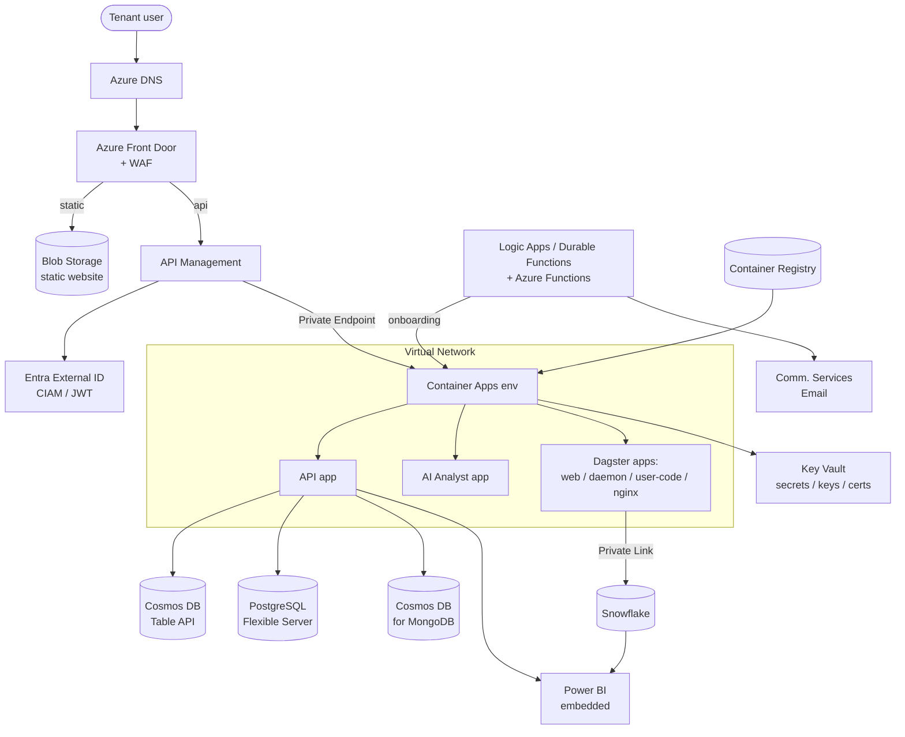

# Azure Re-Architecture — The Same Platform on Azure

> The AXIS IQ data platform rebuilt on **Azure**, service-for-service. Each section maps an AWS component to its Azure equivalent, and explains **what it is, why you'd pick it, and the key configuration steps**. Read the [AWS note](aws-architecture.md) first for the original design; the [overview](index.md) has the full mapping table.

A neat property: because **Power BI is already Microsoft** and **Snowflake/Fivetran/GitHub are SaaS**, moving to Azure actually *reduces* the multi-cloud surface — Power BI becomes native, and the identity story consolidates under Microsoft Entra.

## Renewed architecture diagram (Azure)

---

## 1. DNS & networking

### Route 53 → **Azure DNS + Azure Private DNS zones**
**What:** Azure DNS hosts public zones; **Private DNS zones** provide name resolution inside a VNet.

**Why:** Same split-horizon need — public records for tenant URLs, private zones for internal service names. Private DNS zones are also how **Private Endpoints** get friendly names.

**How to configure:** Create a public DNS zone, delegate the domain (NS records at registrar); add **A/alias** records to Front Door and APIM. Create **Private DNS zones**, **link them to the VNet** (with autoregistration for VMs), and let Private Endpoints auto-create records.

### VPC / subnets → **Virtual Network (VNet) + subnets + NSGs**
**What:** VNet is the isolated network; subnets segment it; **Network Security Groups (NSGs)** are the stateful firewall (≈ security groups).

**Why:** Identical posture — public-facing ingress (Front Door/APIM) up front, workloads and data on **private** subnets/endpoints.

**How to configure:** VNet with subnets for Container Apps (delegated), databases (Private Endpoints), and gateways; **NAT Gateway** for egress; NSGs least-privilege; a **subnet delegated** to the Container Apps environment.

### API Gateway VPC Link → **APIM VNet integration / Private Endpoint**
**What:** How the API gateway reaches private backends. **API Management** can be **VNet-integrated** (internal mode) or reach backends via **Private Endpoints**.

**Why:** Keep the Container Apps backends private while APIM handles ingress — exactly the VPC Link role.

**How to configure:** Deploy APIM in **internal VNet** mode (or Standard v2 with VNet integration); backends addressed by private DNS names; NSGs allow APIM→backend.

### AWS Cloud Map + Service Connect → **Container Apps internal DNS** (or AKS + CoreDNS)
**What:** In **Azure Container Apps**, apps in the same **environment** discover each other by name over internal DNS (`http://<appname>` / `<app>.internal.<env-domain>`), with optional **Dapr** service invocation — no separate registry to run. (On AKS you'd use Kubernetes Services + CoreDNS, adding a mesh like Istio for retries/telemetry.)

**Why:** This is the cleanest match for ECS Service Connect: built-in, name-based, low cognitive load. Dagster's webserver/daemon/user-code call each other by app name.

**How to configure:** Put all Dagster/API apps in **one Container Apps environment**; give backends **internal ingress**; call by app name. Enable **Dapr** if you want service invocation with retries/mTLS/telemetry.

Container Apps vs AKS — which replaces ECS Fargate?

**Container Apps** is the closer match to **ECS Fargate + Service Connect**: serverless containers, scale-to-zero, built-in ingress + internal service discovery + Dapr, no cluster to operate. Choose **AKS** only if you need full Kubernetes control (custom operators, node-level tuning, existing Helm charts, a specific mesh). For this platform's microservices + Dagster, Container Apps is the pragmatic default; AKS is the "we outgrew it" option.

### VPC PrivateLink → **Azure Private Link + Private Endpoints**
**What:** Private connectivity to PaaS/SaaS (Snowflake, PostgreSQL, Key Vault, Cosmos DB, Blob) over the Microsoft backbone via a **Private Endpoint** (a NIC with a private IP in your subnet).

**Why:** Same reason — keep Snowflake and data-store traffic off the public internet; combine with a Private DNS zone for name resolution.

**How to configure:** Create a **Private Endpoint** to each resource/Snowflake; attach the matching **Private DNS zone**; disable public network access on the target.

---

## 2. Edge & security

### CloudFront + AWS WAF → **Azure Front Door + WAF**
**What:** **Azure Front Door** is the global CDN + L7 load balancer + TLS terminator; its **WAF policy** provides managed rules, rate limiting, geo-filtering.

**Why:** One service covers both the CloudFront (edge/CDN) and WAF roles. Route the static site and the API through Front Door with WAF at the edge.

**How to configure:** Front Door **Standard/Premium** profile; **origins** = the Blob static site and APIM; attach a **WAF policy** (Microsoft managed ruleset + custom rate rules); managed TLS certs; custom domains validated via DNS.

Front Door WAF vs Application Gateway WAF

**Front Door WAF** is *global/edge* (best match for CloudFront+WAF). **Application Gateway WAF** is *regional* L7 (use when you need a regional reverse proxy inside a specific region/VNet). The platform's global edge maps to **Front Door**.

### ACM → **Key Vault certificates / managed certificates**
**What:** TLS certs. Front Door/App Service can issue **managed certificates** for free; longer-lived or custom certs live in **Key Vault**.

**Why:** Auto-issued, auto-renewed HTTPS just like ACM.

**How to configure:** Enable Front Door **managed certificate** for custom domains (DNS validation), or import/issue a cert into **Key Vault** and reference it. **Gotcha (parallels ACM/us-east-1):** Front Door is global, so no region pinning — one less footgun than AWS.

### S3 static hosting → **Azure Blob Storage static website**
**What:** A storage account with **static website** hosting serves the built SPA; Front Door caches it.

**Why:** Cheap, durable object storage for the frontend — the S3 equivalent.

**How to configure:** Storage account → enable **Static website** (`index.html`, error doc for SPA routing); upload build to `$web`; front with Front Door + **Private Endpoint**/OAC-style access restriction so only Front Door reads it.

---

## 3. API & authentication

### API Gateway → **Azure API Management (APIM)**
**What:** Full API gateway — routing, throttling, validation, custom domains, policies, developer portal.

**Why:** Direct API Gateway replacement, with a richer **policy engine** (XML/Csharp policies) that can even absorb the authorizer logic.

**How to configure:** Import the API; custom domain + cert; **VNet integration** to reach Container Apps privately; **rate-limit/quota** policies per product for multi-tenant throttling; JWT validation policy (below).

### Lambda authorizer → **APIM `validate-jwt` policy (or Azure Functions)**
**What:** Instead of a separate authorizer compute, APIM's inbound **`validate-jwt`** policy validates the Entra token and extracts the tenant claim; for heavier logic, call an **Azure Function**.

**Why:** Fewer moving parts than a Lambda authorizer — the gateway itself enforces auth and can set the tenant context header. Use a Function only if you need custom cookie handling (the Dagster auth cookie).

**How to configure:** Add `validate-jwt` (OpenID config URL = the Entra External ID tenant), check audience/issuer, map a claim (`tenantId`) to a backend header; cache JWKS automatically.

### Cognito → **Microsoft Entra External ID**
**What:** Microsoft's **CIAM** platform — the GA successor to Azure AD B2C (B2C is closed to new customers since May 2025). Provides customer sign-up/sign-in, MFA, social/federated identity, and OIDC/OAuth2 tokens.

**Why:** Direct Cognito replacement for customer identity. Bonus: it unifies with the rest of the Microsoft/Power BI stack, so embedding and service principals live in the same directory.

**How to configure:** Create an **external tenant**; register the app; define **user flows** (wizard-driven sign-up/sign-in, MFA, branding) — simpler than B2C custom policies; issue JWTs that APIM validates; provision users + send invites (via ACS Email) during onboarding.

Why not "Azure AD B2C"?

B2C went end-of-sale to new customers on **May 1, 2025**; existing tenants are supported through ~2030 but new builds should target **Entra External ID**. It trades B2C's XML custom-policy flexibility for wizard-driven user flows — easier and the strategic direction.

---

## 4. Compute & orchestration

### ECS/Fargate → **Azure Container Apps** (Dagster + API + AI Analyst)
**What:** Serverless containers with autoscaling (incl. scale-to-zero), built-in ingress, revisions/rolling deploys, and internal service discovery.

**Why:** Closest match to ECS Fargate + Service Connect (see §1). Run each Dagster component and the API/AI-Analyst services as separate **container apps** in one **environment**.

**How to configure:** Create a **Container Apps environment** bound to the VNet subnet; one **app** per service (image from ACR, CPU/mem, scale rules, env + **Key Vault-referenced secrets**, **managed identity** for Azure access); internal ingress for east-west, external ingress fronted by APIM/Front Door.

### The Dagster stack on Azure
Same 3-plane split — webserver, daemon, user-code gRPC, plus NGINX — each a container app; metadata in **PostgreSQL Flexible Server**; discovery via the environment's internal DNS names (replacing Cloud Map/Service Connect).

### EC2 + ASG (MongoDB) → **Cosmos DB for MongoDB** (preferred) or **VM Scale Sets**
**What:** Replace self-managed Mongo either with the **managed** Cosmos DB **MongoDB API** (no servers to run) or, to stay self-managed, **VM Scale Sets** + **Managed Disks**.

**Why:** Azure *does* offer a first-class managed MongoDB-wire-compatible service (Cosmos DB for MongoDB), so you can drop the EC2/ASG ops burden entirely — a genuine improvement over the AWS design. Keep VMSS only if you need a specific Mongo version/features Cosmos doesn't cover.

**How to configure (managed):** Create a Cosmos DB **MongoDB API** account; use the Mongo connection string (stored in Key Vault); set throughput (RU/s or autoscale) + geo-redundancy. **(VMSS path):** scale set across zones, Managed Disks (Premium SSD), backups.

---

## 5. Data stores

### DynamoDB → **Azure Cosmos DB (Table API)**
**What:** Globally distributed, low-latency NoSQL. The **Table API** is the closest key-value match; the Core (SQL) API is the richer document option.

**Why:** Single-digit-ms tenant/session lookups on the authorizer hot path — the DynamoDB role.

**How to configure:** Cosmos DB account (Table API), partition key = `tenantId`, **autoscale** throughput, encryption at rest (Microsoft- or customer-managed keys), PITR/continuous backup, Private Endpoint.

### Aurora/RDS Postgres → **Azure Database for PostgreSQL Flexible Server**
**What:** Managed PostgreSQL with zone-redundant HA, read replicas, and VNet integration.

**Why:** Core platform state + Dagster metadata — same relational role, fully managed.

**How to configure:** Flexible Server in the VNet (Private Access), **zone-redundant HA**, credentials in **Key Vault** (or Entra auth), CMK encryption, automated backups.

### Snowflake → **Snowflake (unchanged)**
Stays as-is; connect via **Azure Private Link** instead of AWS PrivateLink. (If mandated to go native, **Microsoft Fabric / Synapse** could replace it — but that's a rewrite of the whole dbt/warehouse layer, so keep Snowflake.)

---

## 6. Secrets, config & encryption

### Secrets Manager + SSM + KMS + ACM → **Azure Key Vault (+ App Configuration)**
**What:** **Key Vault** consolidates four AWS services: **secrets** (Secrets Manager), **keys** (KMS), and **certificates** (ACM). Non-secret config maps to **Azure App Configuration** (the SSM Parameter Store analog).

**Why:** One vault for secrets/keys/certs simplifies the design. Keep the same per-tenant **naming convention** (`dp-dev-tenants-<tenantid>-snowflake-api`) and enforce isolation with **RBAC + access policies**.

**How to configure:** Key Vault with **RBAC** authorization; secrets named per tenant/system; container apps use **managed identity** to read (scoped by RBAC so tenant A can't read tenant B); **keys** for CMK encryption with rotation; **certificates** for TLS. Put feature flags/endpoints in **App Configuration**.

Tenant isolation on Azure — the key detail

On AWS, isolation was IAM policies scoped to `dp/dev/tenants/[tenantid]/*`. On Azure, it's **RBAC role assignments** scoped to specific Key Vault secrets (or per-tenant vaults) granted to each app's **managed identity**. Same principle: identity-scoped, least-privilege access is the real isolation boundary.

---

## 7. Automation, onboarding & notifications

### Step Functions → **Logic Apps or Durable Functions**
**What:** Durable, multi-step workflow orchestration. **Logic Apps** = low-code connectors + visual designer; **Durable Functions** = code-first orchestration (C#/Python/JS) with fan-out/retry.

**Why:** The tenant-onboarding saga (Snowflake account → keypair → Key Vault secrets → DNS → Container Apps deploy → Entra setup → email invite) needs durable state, retries, and error handling. **Durable Functions** is the closer match to Step Functions' code-orchestration style; Logic Apps if you prefer connectors.

**How to configure (Durable Functions):** An **orchestrator function** calls **activity functions** per step with automatic checkpointing/retries; managed identity for least-privilege access to each service; triggered by the onboarding API.

### Lambda → **Azure Functions**
Event-driven/glue compute → **Azure Functions** (Consumption or Flex plan), triggered by HTTP/queues/timers, using managed identity and Key Vault references.

### SES → **Azure Communication Services (ACS) Email**
**What:** Managed transactional email with domain verification (SPF/DKIM), managed or custom sender domains.

**Why:** SES equivalent for invites/verification email during onboarding and Entra flows.

**How to configure:** Create an **Email Communication Service**; add an **Azure managed domain** (one-click, `*.azurecomm.net`) or a **custom domain** (verify with **SPF + DKIM** DNS records); connect it to a Communication Services resource; send via SDK from the onboarding Function.

---

## 8. CI/CD, registries & source

### ECR → **Azure Container Registry (ACR)**
**What:** Private Docker registry with vulnerability scanning (Microsoft Defender), geo-replication, and tasks.

**Why:** Container Apps/AKS pull images from ACR — the direct ECR replacement.

**How to configure:** ACR (Premium for geo-rep + Private Endpoint); enable **Defender** scanning + retention; Container Apps pull with **managed identity** (no admin creds); GitHub Actions push via **OIDC federation** to Azure.

### S3 registries → **Azure Blob Storage** (Terraform state + package registry)
**What:** Blob containers for the **Terraform state backend** (`azurerm` backend with state locking) and the **package registry** (dbt/Power BI artifacts).

**Why:** Same decoupling of build vs deploy; versioned artifacts pulled by tenant deployments.

**How to configure:** Storage account + containers; **`azurerm` Terraform backend** (blob + native state locking); versioning/soft-delete on; Private Endpoint; CI publishes artifacts.

### GitHub → **GitHub (unchanged)** with Azure OIDC
Stays GitHub; Actions authenticate to Azure via **workload identity federation (OIDC)** — no stored secrets — and deploy to ACR/Container Apps/Key Vault.

---

## 9. Data integration & BI

### Fivetran → **Fivetran (unchanged)** or **Azure Data Factory**
Keep **Fivetran** (SaaS, cloud-agnostic) landing into Snowflake; connect privately via Azure Private Link. Only swap to **Azure Data Factory / Synapse pipelines** if standardizing on native Azure ELT is a hard requirement.

### dbt → **dbt (unchanged)**
Runs inside the Dagster user-code container app against Snowflake exactly as on AWS.

### Power BI → **Power BI (now native)**
**What:** The reporting layer — already Microsoft, so on Azure it's first-class: workspace + **embedded** capacity, service principal in the same **Entra** tenant.

**Why:** No cross-cloud identity hop anymore; the App Registration/Service Principal that was a separate Azure island in the AWS design is now part of the home cloud.

**How to configure:** Entra **App Registration/Service Principal**; Power BI **workspace** assigned to **embedded (Fabric/Premium) capacity**; datasets connect to Snowflake PROD; the API app requests **embed tokens** (secret in Key Vault).

### Observability: CloudWatch → **Azure Monitor + Log Analytics + Application Insights**
Container Apps/APIM/Front Door emit metrics/logs to **Log Analytics**; **Application Insights** for app traces; alerts + dashboards in **Azure Monitor**.

---

## Azure design improvements worth calling out

- **Managed MongoDB** (Cosmos DB for MongoDB) removes the EC2/ASG self-management from the AWS design.
- **One Key Vault** replaces four AWS services (Secrets Manager + SSM + KMS + ACM) for secrets/keys/certs.
- **Front Door** is a single global edge (CDN + WAF + TLS), with no `us-east-1` region-pinning gotcha.
- **Container Apps** gives built-in service discovery, so you don't run both Cloud Map *and* Service Connect.
- **Native Power BI + Entra** collapses the AWS design's cross-cloud identity/BI seam into the home cloud.
- **APIM policies** can absorb the Lambda-authorizer's JWT validation, removing a compute hop.

## Gotchas & interview traps

- **Entra External ID, not Azure AD B2C** — B2C is closed to new customers (since May 2025).
- **Container Apps environment = the discovery boundary** — apps only resolve each other by name within the *same* environment (mirror of the ECS namespace/Service Connect scope).
- **Private Endpoint + Private DNS zone always go together** — the endpoint gives the private IP, the zone makes the PaaS hostname resolve to it. Forgetting the DNS zone is the classic "why can't I reach my private database" bug.
- **Managed identity over secrets** — prefer managed identity + RBAC to reach Key Vault/ACR/DBs; it's the idiomatic Azure isolation model and beats storing credentials.
- **Cosmos partition key choice** matters as much as a DynamoDB partition key — pick `tenantId` for even, tenant-scoped distribution.

## Related

- [Overview & tenancy model](index.md)
- [AWS architecture — component by component](aws-architecture.md)

## References

- [Azure DNS + Private DNS zones](https://learn.microsoft.com/en-us/azure/dns/private-dns-overview)
- [Azure Private Link / Private Endpoint](https://learn.microsoft.com/en-us/azure/private-link/private-link-overview)
- [Azure Front Door + WAF](https://learn.microsoft.com/en-us/azure/frontdoor/web-application-firewall)
- [Blob Storage static website hosting](https://learn.microsoft.com/en-us/azure/storage/blobs/storage-blob-static-website)
- [Azure API Management overview](https://learn.microsoft.com/en-us/azure/api-management/api-management-key-concepts)
- [APIM `validate-jwt` policy](https://learn.microsoft.com/en-us/azure/api-management/validate-jwt-policy)
- [Microsoft Entra External ID overview](https://learn.microsoft.com/en-us/entra/external-id/external-identities-overview)
- [Azure Container Apps — service discovery / internal ingress](https://learn.microsoft.com/en-us/azure/container-apps/connect-apps)
- [Azure Container Registry](https://learn.microsoft.com/en-us/azure/container-registry/container-registry-intro)
- [Azure Cosmos DB (Table API)](https://learn.microsoft.com/en-us/azure/cosmos-db/table/introduction)
- [Azure Cosmos DB for MongoDB](https://learn.microsoft.com/en-us/azure/cosmos-db/mongodb/introduction)
- [Azure Database for PostgreSQL Flexible Server](https://learn.microsoft.com/en-us/azure/postgresql/flexible-server/overview)
- [Azure Key Vault overview](https://learn.microsoft.com/en-us/azure/key-vault/general/overview)
- [Durable Functions overview](https://learn.microsoft.com/en-us/azure/azure-functions/durable/durable-functions-overview)
- [Azure Communication Services — email domains](https://learn.microsoft.com/en-us/azure/communication-services/concepts/email/email-domain-and-sender-authentication)
- [Snowflake Azure Private Link](https://docs.snowflake.com/en/user-guide/privatelink-azure)
- [Power BI embedded analytics](https://learn.microsoft.com/en-us/power-bi/developer/embedded/embedded-analytics-power-bi)
