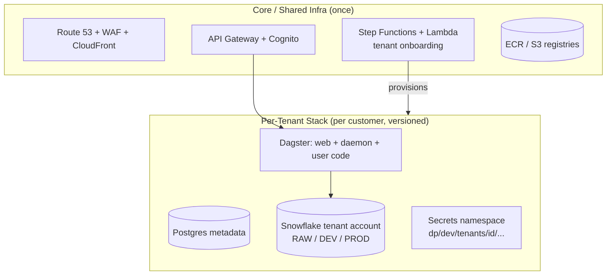
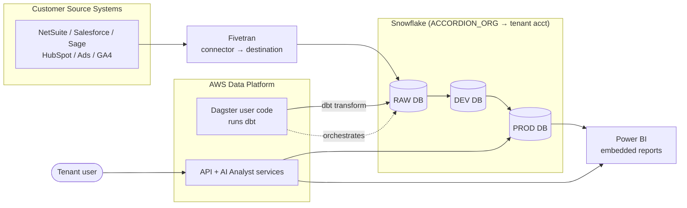

# AXIS IQ Data Platform — Architecture Overview

> A real-world, **multi-tenant SaaS data platform** (Accordion's "AXIS IQ", DEV environment) that ingests customer source systems, replicates them into Snowflake, transforms them with dbt orchestrated by Dagster, and serves the results through a secured web/API layer with embedded Power BI reporting. This topic explains **every component**, first as built on **AWS**, then re-architected on **Azure**.

## Why study this

It is a compact tour of almost every category a backend/data/cloud interview cares about: DNS, edge security (WAF/CDN), API gateway + auth, containerized microservices with service discovery, an orchestration engine (Dagster), managed + self-managed data stores, secrets/crypto, event-driven onboarding automation, a cloud data warehouse (Snowflake), ELT replication (Fivetran), and multi-cloud glue (AWS + Azure + GitHub + Snowflake). Understanding *why* each piece exists — and how you'd rebuild it on another cloud — is exactly the kind of systems reasoning interviewers probe.

Read this page for the **big picture and the AWS↔Azure map**, then dive into:

- [AWS architecture — component by component](aws-architecture.md)
- [Azure re-architecture — the same system on Azure](azure-architecture.md)

## The tenancy model (the key idea)

AXIS IQ is **multi-tenant SaaS**, and the diagram uses one tenant — **NorthBeam** — as the running example. The platform separates two planes:

- **Core / shared infra** — deployed once, serves *all* tenants: DNS, WAF, CDN, the API gateway, the auth (Cognito) layer, the tenant-onboarding automation, shared data stores, secrets, registries.
- **Per-tenant deployment** — a dedicated, *versioned* stack spun up for each tenant: its own **Dagster** orchestration cluster (webserver + daemon + gRPC user code + NGINX), its own Postgres metadata DB, its own Snowflake account, its own secrets namespace (`dp/dev/tenants/[tenantid]/...`), and its own DNS records (`northbeam-data-platform.dev.accordionintelligence.com`).

**Interview trap:** notice the platform mixes *shared* and *isolated* resources. Onboarding (`ACCORDION_ORG` Snowflake org account → creates `AXISIQ_NORTHBEAM` tenant account) is the seam. Snowflake isolation is at the **account** level per tenant; app isolation is at the **secret namespace + dedicated Dagster stack** level. Know *which resources are shared vs per-tenant and why* — it's the crux of any SaaS design question.

## End-to-end data flow

1. **Ingest**: Fivetran connectors pull each source system and land raw data in the tenant's Snowflake **RAW** database.
2. **Transform**: Dagster schedules/materializes assets; the **user-code** container runs **dbt** models against Snowflake, promoting RAW → DEV → PROD.
3. **Serve**: the web app + API (behind CloudFront/WAF/API Gateway/Cognito) expose the curated data; **Power BI** embedded reports visualize PROD; an **AI Analyst** service answers questions over the data.
4. **Onboard**: Step Functions + Lambda provision a new tenant end-to-end (Snowflake account, secrets, DNS, Dagster stack, Cognito, email invite).

## AWS → Azure service map

This is the quick-reference table; each row is explained in depth in the [AWS](aws-architecture.md) and [Azure](azure-architecture.md) notes.

| Concern | AWS (in the diagram) | Azure equivalent |
|---|---|---|
| DNS (public + private) | Route 53 hosted zones | Azure DNS + Azure Private DNS zones |
| Virtual network | VPC, public/private subnets | Virtual Network (VNet) + subnets |
| Private API → backend | API Gateway **VPC Link** | APIM VNet integration / Private Endpoint |
| Service discovery | **AWS Cloud Map** + ECS Service Connect | Container Apps internal DNS / AKS + CoreDNS |
| Private SaaS connectivity | VPC **PrivateLink** (Snowflake) | Azure **Private Link** |
| Edge security + CDN | **CloudFront** + **AWS WAF** | **Azure Front Door** + WAF |
| TLS certificates | **ACM** | Key Vault certificates / managed certs |
| Static web hosting | **S3** static website | **Blob Storage** static website |
| API gateway | **API Gateway** (REST) | **Azure API Management** |
| Custom authorizer | **Lambda authorizer** | APIM policy / **Azure Functions** |
| Customer identity (CIAM) | **Cognito user pool** | **Microsoft Entra External ID** |
| Transactional email | **SES** | **Azure Communication Services Email** |
| Container orchestration | **ECS** (Fargate) + Service Connect | **Azure Container Apps** (or AKS) |
| Container registry | **ECR** | **Azure Container Registry (ACR)** |
| Key-value / NoSQL | **DynamoDB** | **Cosmos DB** (Table API) |
| Relational DB | **Aurora/RDS PostgreSQL** | **Azure Database for PostgreSQL Flexible Server** |
| Document DB (self-managed) | **MongoDB on EC2 + ASG** | **Cosmos DB for MongoDB** (or VMSS/AKS) |
| Secrets | **Secrets Manager** | **Azure Key Vault** |
| App config / parameters | **SSM Parameter Store** | **Key Vault** + **App Configuration** |
| Encryption keys | **AWS KMS** | **Key Vault** keys / Managed HSM |
| Workflow orchestration | **Step Functions** | **Logic Apps** / **Durable Functions** |
| Functions (FaaS) | **Lambda** | **Azure Functions** |
| VM autoscaling | **EC2 + Auto Scaling Group** | **VM Scale Sets** |
| Block storage | **EBS** | **Azure Managed Disks** |
| Object storage (registries) | **S3** (infra + package registry) | **Azure Blob Storage** |
| IaC identity | Azure App Registration / SP (already Azure) | (same) Entra App Registration |
| Observability | CloudWatch (implied) | **Azure Monitor** + Log Analytics |
| Data warehouse | **Snowflake** (SaaS) | Snowflake (unchanged) or Fabric/Synapse |
| ELT replication | **Fivetran** (SaaS) | Fivetran (unchanged) or Azure Data Factory |
| BI | **Power BI** (already Azure) | Power BI (unchanged) |

**Note on SaaS components:** Snowflake, Fivetran, GitHub, and Power BI are external SaaS and stay the same on either cloud — only how you *connect privately* to them changes (PrivateLink → Private Link). Power BI is already an Azure/Microsoft product, which is why this platform is multi-cloud even on "AWS".

## Related

- [AWS architecture — component by component](aws-architecture.md)
- [Azure re-architecture](azure-architecture.md)
- [Tenant onboarding workflow](tenant-onboarding.md)
- [Multi-tenant application best practices (deep dive)](../multi-tenancy.md)

## References

- [AWS Architecture Center — SaaS lens](https://docs.aws.amazon.com/wellarchitected/latest/saas-lens/saas-lens.html)
- [Azure Architecture Center — Multitenant SaaS](https://learn.microsoft.com/en-us/azure/architecture/guide/multitenant/overview)
- [Snowflake — Organizations and accounts](https://docs.snowflake.com/en/user-guide/organizations)
- [Dagster — Deploying on ECS](https://docs.dagster.io/deployment/oss/deployment-options/aws)
