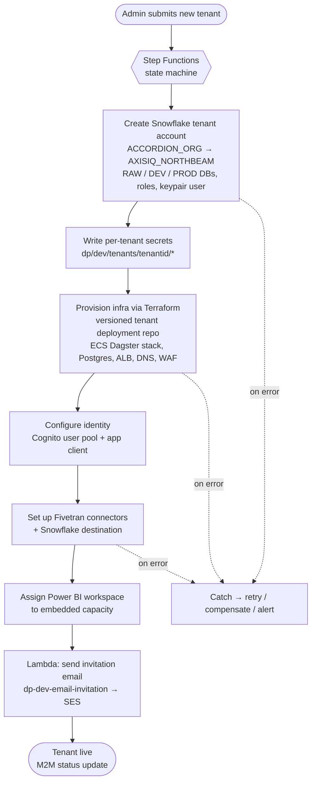

# Tenant Onboarding Workflow

> How AXIS IQ turns "a new customer signed up" into a fully provisioned, isolated tenant — a **Step Functions**-orchestrated saga of **Lambda** steps that creates the Snowflake account, writes per-tenant secrets, deploys the tenant's stack, wires identity, and sends the invite. This is the seam where the platform's [shared and per-tenant planes](index.md#the-tenancy-model-the-key-idea) meet. For the general theory, see the [multi-tenancy deep dive](../multi-tenancy.md).

## Why an orchestrated workflow (not one big Lambda)

Onboarding is **long, multi-step, and partially failure-prone**: it spans Snowflake, Secrets Manager, Terraform-driven infra, Cognito, Fivetran, Power BI, and email. Any step can fail or be slow (creating a Snowflake account isn't instant). You need:

- **Durable state** — survive minutes-to-hours of execution without holding a Lambda open.
- **Per-step retries with backoff** — transient API failures shouldn't fail the whole onboarding.
- **Explicit error handling / compensation** — if step 6 fails, cleanly roll back or park for a human.
- **Visibility** — see exactly which tenant is stuck at which step.

That is precisely what **AWS Step Functions** provides (a state machine of `Task`/`Choice`/`Map`/`Parallel` states), which is why the diagram pairs **Step Functions + Lambda** under *Tenant Onboarding*.

## The two secret namespaces

The diagram splits onboarding secrets into two groups, and understanding the split explains the whole flow:

| Group | Path | Purpose |
|---|---|---|
| **Management** (shared) | `dp/dev/tenant/onboarding/snowflake/creds`, `.../creds/rsa/public`, `.../creds/rsa/private` | The *privileged* org-level Snowflake credentials + RSA keypair the workflow uses to **create** new tenant accounts. Owned by the platform, never exposed to tenants. |
| **Tenant deployment** (per tenant) | `dp/dev/tenants/[tenantid]/snowflake/api`, `.../fivetran/api`, `.../postgres/api`, `.../redis/api`, `.../mongodb/api`, `.../powerbi/api`, `.../clientapp/data/aurora/auth` | The *scoped* credentials the running tenant stack uses. **Written by the workflow**, read only by that tenant's workloads. |

The workflow's job is essentially: **use the management secrets to mint a tenant, then write that tenant's own scoped secrets.**

## The onboarding saga

Step by step:

1. **Create the Snowflake tenant account.** Using the *management* creds + RSA keypair, the org account (`ACCORDION_ORG`) runs `CREATE ACCOUNT` to provision the tenant account (`AXISIQ_NORTHBEAM`), then creates the **RAW / DEV / PROD** databases, warehouses, and roles, and a keypair-auth service user.
2. **Write per-tenant secrets.** The workflow stores the new tenant's scoped credentials under `dp/dev/tenants/[tenantid]/...` (Snowflake API user, Fivetran, Postgres, Redis, MongoDB, Power BI, Aurora auth). This namespace *is* the tenant's isolation boundary.
3. **Provision the tenant stack (Terraform).** The **versioned tenant deployment** (infra code in `accordion-clients/data-platform-northbeam`, state in the S3 infra registry) stands up the per-tenant Dagster cluster, its Postgres metadata DB, the private ALB, Route 53 records (`northbeam-data-platform.dev...`), and WAF associations.
4. **Configure identity.** Create/configure the tenant's **Cognito user pool** (`dp-northbeam-dev-uw2`) and app client so users can authenticate and the Lambda authorizer can resolve `tenantId`.
5. **Set up ingestion.** Register **Fivetran** connectors for the tenant's sources and point the destination at their Snowflake account (using the `fivetran/api` secret).
6. **Wire BI.** Assign the tenant's **Power BI workspace to embedded capacity** (the Azure/IaC service principal), so embedded reports work.
7. **Invite the user.** The `dp-dev-email-invitation` **Lambda** composes and sends the welcome/invite email via **SES**.
8. **Report status.** A machine-to-machine (**M2M**) status update marks the tenant active in the control plane.

Where the "versioned tenant deployment" fits

Onboarding isn't just runtime API calls — infra is **GitOps**. The tenant's stack is described as **versioned Terraform** in the client deployment repo; app code (dbt common packages, `config.yml`, override/custom models) is pinned to versions pulled from the **S3 package registry**. Re-running onboarding (or an upgrade) is therefore a *deploy of a known version*, not ad-hoc mutation — which is what makes it repeatable and auditable across dozens of tenants.

## Best practices this workflow demonstrates (and interview talking points)

- **Idempotency.** Every step must be safe to retry. Use deterministic names (`AXISIQ_<TENANT>`), "create if not exists" semantics, and check-before-create so a retried step doesn't create duplicates. Step Functions *will* re-run a step after a transient failure.
- **Saga with compensation.** There's no distributed transaction across Snowflake + AWS + Fivetran + Power BI. Model onboarding as a **saga**: on failure, either retry the step or run **compensating actions** (delete the half-created account/secrets) and alert — don't leave a zombie tenant.
- **Least-privilege execution role.** The Step Functions/Lambda execution role should be scoped to exactly the actions each step needs (e.g. `secretsmanager:PutSecretValue` only on `dp/dev/tenants/*`). The *management* Snowflake creds are the crown jewels — tightly guarded, never handed to tenant workloads.
- **Separate the privileged "minting" identity from the tenant runtime identity.** Management secrets create tenants; tenant secrets run tenants. Never let a tenant's role reach the management namespace.
- **Human-in-the-loop for risky steps.** Step Functions supports **`waitForTaskToken`** — pause for manual approval (e.g. before creating a billable Snowflake account) and resume when a human signs off.
- **Emit tenant-scoped telemetry.** Tag every step's logs/metrics with `tenantId` so a stuck onboarding is instantly attributable.
- **Make it re-runnable.** Because infra is versioned Terraform + pinned packages, onboarding doubles as the *upgrade* path — the same machinery rolls a tenant forward to a new platform version.

## Gotchas

- **Snowflake account creation is asynchronous and slow** — poll for readiness (a `Choice`/`Wait` loop or `waitForTaskToken`) rather than assuming it's instant.
- **Secret-write ordering matters** — the tenant stack (step 3) can't start until its secrets (step 2) exist; encode that dependency in the state machine, don't parallelize blindly.
- **Partial failure is the norm, not the exception** — the most common bug is a tenant left half-provisioned with no cleanup. Test the failure/rollback paths explicitly.
- **Cross-cloud step (Power BI on Azure)** — step 6 crosses into Azure via the App Registration/Service Principal; its credentials live in `dp/dev/tenants/[tenantid]/powerbi/api`. A cross-cloud call is a common point of flakiness — retry it.

## Related

- [Overview & tenancy model](index.md)
- [AWS architecture — Secrets Manager, Step Functions, Cognito](aws-architecture.md)
- [Multi-tenant application best practices (deep dive)](../multi-tenancy.md)

## References

- [AWS Step Functions developer guide](https://docs.aws.amazon.com/step-functions/latest/dg/welcome.html)
- [Step Functions — wait for a callback with the task token](https://docs.aws.amazon.com/step-functions/latest/dg/connect-to-resource.html#connect-wait-token)
- [Snowflake — CREATE ACCOUNT](https://docs.snowflake.com/en/sql-reference/sql/create-account)
- [Snowflake — key-pair authentication](https://docs.snowflake.com/en/user-guide/key-pair-auth)
- [AWS Secrets Manager — resource-based policies](https://docs.aws.amazon.com/secretsmanager/latest/userguide/auth-and-access_resource-based-policies.html)
- [AWS SaaS Lens — onboarding](https://docs.aws.amazon.com/wellarchitected/latest/saas-lens/onboarding.html)
- [Saga pattern](https://docs.aws.amazon.com/prescriptive-guidance/latest/cloud-design-patterns/saga.html)
