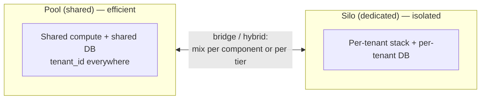
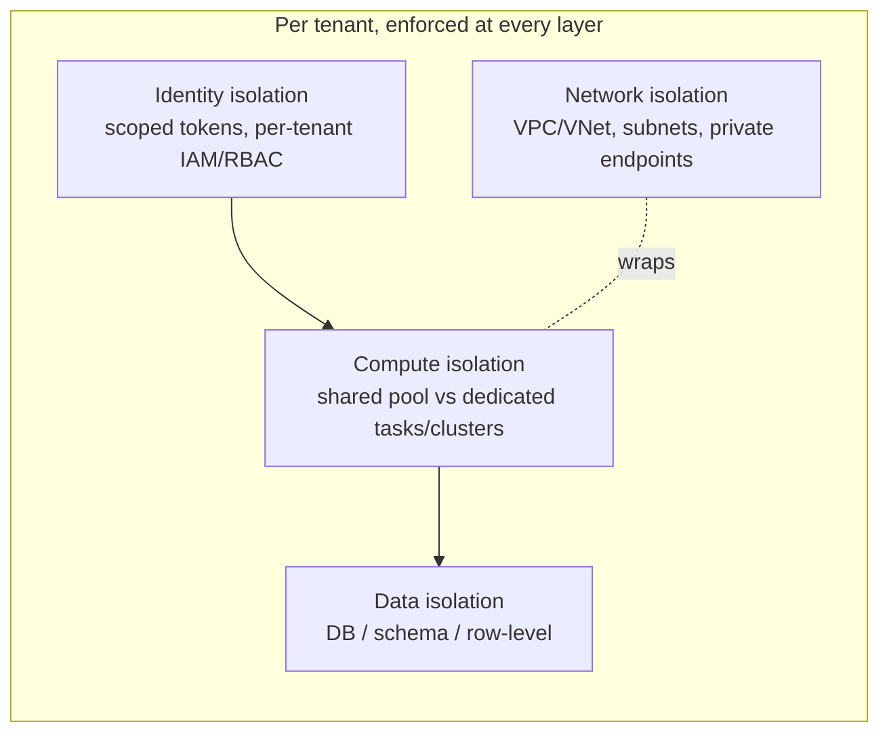

# Multi-Tenant Application Design — Deep Dive

> A **multi-tenant** application serves many customers ("tenants") from one logical system while keeping each tenant's data and experience isolated. This note is the deep dive on how to do it *well*: the tenancy models, how to isolate data/compute/network/identity, how to stop tenants stepping on each other, and the operational realities (onboarding, metering, scaling, compliance). Grounded in the AWS SaaS Lens and Azure's multitenancy guidance, with the [AXIS IQ platform](data-platform-architecture/index.md) as a running example.

## Why multi-tenancy is hard (and worth it)

Running one shared system for all customers gives you **economies of scale, one codebase to operate, and fast onboarding**. The cost is that you must engineer, at every layer, the isolation that a single-tenant deployment gets for free. Get it wrong and you leak tenant A's data to tenant B (catastrophic) or let one tenant's load degrade everyone (the *noisy neighbor* problem). Multi-tenancy is fundamentally a series of **isolation vs. efficiency trade-offs** — and the interview signal is whether you can reason about them per layer, not just recite "use a tenant_id column."



## The tenancy models

Both AWS and Azure converge on the same spectrum, with different names:

| Spectrum | AWS SaaS Lens | Azure Architecture Center |
|---|---|---|
| Fully shared | **Pool** | Shared / fully multitenant deployment |
| Mixed | **Bridge** | Horizontally partitioned / hybrid |
| Fully dedicated | **Silo** | Single-tenant deployment (per-tenant **deployment stamp**) |

- **Pool (shared):** all tenants share compute and a database; data is separated logically by a **tenant identifier**. Cheapest, most scalable, easiest to operate — but isolation is *only as strong as your code and policies*, and it's the most exposed to noisy neighbors.
- **Silo (dedicated):** each tenant gets its own stack/database (or even account/subscription). Strongest isolation, simplest data model, natural for compliance/data-residency and premium tiers — but expensive, slower to onboard, and harder to operate at scale (N stacks to patch).
- **Bridge / hybrid:** the real world. Silo what *must* be isolated (e.g. storage, or a regulated tenant), pool the rest (e.g. the stateless app tier). Very common: **pool the free/basic tier, silo premium tenants**.

**Golden rule (from the AWS guidance):** *start with the simplest model that meets your requirements and build in the flexibility to add isolation where specific customers need it.* Don't silo everything "to be safe" — you'll drown in operational cost.

### Deployment stamps (the silo/scale unit)
A **deployment stamp** is a complete, independent copy of the stack (compute + data + config) serving a bounded set of tenants. Stamps are your unit of **scale, fault isolation, and compliance boundary**: deploy them with IaC (Terraform/Bicep), route tenants to a stamp, and add stamps as you grow. AXIS IQ's per-tenant Dagster stack + Snowflake account is effectively a per-tenant stamp.

## The four isolation dimensions

Isolation is not one decision — make it per layer:



### 1. Data isolation — the models that matter most
This is where interviews spend the most time. Three concrete patterns, in increasing sharing:

| Pattern | Isolation | Cost / density | Notes |
|---|---|---|---|
| **Database per tenant** (silo) | Strongest | Lowest density | Simple queries, easy per-tenant backup/restore/encryption, easy data-residency. Connection/ops explosion at scale. |
| **Schema per tenant** (bridge) | Medium | Medium | One DB instance, separate schemas. Balances isolation and cost; migrations must fan out across schemas. |
| **Shared table + `tenant_id`** (pool) | Weakest (logical) | Highest density | Classic multi-tenancy. Every table carries `tenant_id`; every query *must* filter by it. Cheapest, but a single missing predicate = cross-tenant leak. |

For the **pooled** model, enforce isolation *below* the application with **Row-Level Security (RLS)** so the database itself refuses to return other tenants' rows even if a query forgets the filter:

```sql
-- Postgres row-level security for pooled multi-tenancy
ALTER TABLE orders ENABLE ROW LEVEL SECURITY;

CREATE POLICY tenant_isolation ON orders
  USING (tenant_id = current_setting('app.current_tenant')::uuid);

-- App sets the tenant context per connection/transaction:
SET app.current_tenant = '4b9c...';   -- from the validated token, never from user input
```

**Defense in depth:** don't rely on app code alone. Combine (a) a validated tenant context, (b) a data-access layer that always injects the tenant predicate, and (c) RLS/policy at the store. Any one of them failing shouldn't cause a leak.

### 2. Identity & access isolation
Tenant context must be a **first-class, server-derived concept** — put `tenantId` in the validated JWT claim (or session), *never* trust a client-supplied header/param. Then scope access:

- **Token-scoped:** the auth layer resolves the tenant and stamps it into the request context (AXIS IQ's **Lambda authorizer** returns `{ tenantId }`; Azure's APIM `validate-jwt` maps the claim to a header).
- **Dynamically-scoped credentials (the strong pattern):** derive short-lived, tenant-scoped credentials per request. On AWS, use **IAM dynamic/ABAC policies** with `${aws:PrincipalTag/tenantId}` or `sts:AssumeRole` + session policies so the *credentials themselves* can only touch that tenant's resources (e.g. S3 prefix, DynamoDB leading key, Secrets Manager path). On Azure, use **managed identity + RBAC** scoped to per-tenant resources.

```jsonc
// AWS: an S3 policy that isolates by tenant using ABAC — the caller's
// session is tagged with tenantId; they can only reach their own prefix.
{
  "Effect": "Allow",
  "Action": "s3:GetObject",
  "Resource": "arn:aws:s3:::data-bucket/${aws:PrincipalTag/tenantId}/*"
}
```

This is what makes AXIS IQ's `dp/dev/tenants/[tenantid]/*` secret naming an *actual* boundary: IAM/RBAC scoped to the path means tenant A's role physically cannot read tenant B's secrets.

### 3. Compute isolation
- **Pooled compute:** shared containers/functions handle all tenants; cheapest, but needs quotas + throttling to prevent noisy neighbors.
- **Siloed compute:** dedicated tasks/clusters (or stamps) per tenant; used for premium/regulated tenants. AXIS IQ silos the Dagster/transform compute per tenant while pooling the shared API edge.

### 4. Network isolation
Shared ingress (WAF/CDN/API gateway) up front; private subnets/endpoints for data. Siloed tenants can get dedicated VPCs/VNets or subscriptions; pooled tenants share the network but are separated at the identity/data layers.

## The noisy neighbor problem
In any *pooled* resource, one tenant's spike can starve others. Mitigations (mix several):

- **Quotas & rate limits** per tenant at the API gateway (API Gateway usage plans / APIM products).
- **Throttle expensive operations** — cap query time, page sizes, max returned rows, concurrent jobs.
- **Async + off-peak** for heavy, non-time-sensitive work (queues, batch windows).
- **Rebalance / bin-pack tenants** across stamps so complementary usage patterns flatten peaks; move a chronic offender to its own silo.
- **Per-tenant usage tracking** — attribute consumption (e.g. Cosmos DB **request units**, DB CPU, tokens) to each `tenantId` so you can *see* the noisy neighbor and act (throttle, upsell to a dedicated tier, or isolate).

## Operational concerns (what separates a demo from a product)

### Onboarding & offboarding
Automate the full lifecycle: provision tenant resources, seed identity, write secrets, register routing — as an **idempotent, retryable workflow** (see the [AXIS IQ tenant-onboarding saga](data-platform-architecture/tenant-onboarding.md)). Offboarding matters too: a clean, auditable teardown + data export/retention per contract.

### Metering, billing & tiering
Emit **per-tenant usage events** (requests, storage, compute-seconds, tokens) tagged with `tenantId`; aggregate for billing and for enforcing tier limits. Tiering is where the tenancy models pay off: *basic = pooled*, *premium = siloed/dedicated stamp with a dedicated encryption key and data-residency guarantee*.

### Per-tenant observability
Tag **every** log line, metric, and trace with `tenantId`. Without it you can't answer "is tenant X slow?", attribute cost, or debug a leak. This is the single highest-leverage operational habit in multi-tenancy.

### Schema & deployment changes across tenants
- **Pooled:** one migration, but it hits everyone at once — must be backward-compatible and zero-downtime.
- **Silo/schema-per-tenant:** migrations **fan out** across N databases/schemas — needs orchestration, versioning, and the ability to roll tenants forward independently (AXIS IQ's *versioned tenant deployment* enables exactly this).
- Limit schema divergence between tenants even in bridge mode, or migrations become unmanageable.

### Security & compliance
- **Per-tenant encryption keys (BYOK/CMK)** for tenants needing cryptographic isolation or the ability to revoke access by destroying a key.
- **Data residency** — silo regulated tenants into a region/stamp that satisfies their jurisdiction.
- **Test isolation deliberately** — verify no cross-tenant leakage; use fault injection (e.g. Azure Chaos Studio) to confirm noisy-neighbor behavior is acceptable.

## Trade-off summary

| Dimension | Pool (shared) | Silo (dedicated) |
|---|---|---|
| Cost / density | ✅ Best | ❌ Worst |
| Isolation strength | ❌ Logical only | ✅ Physical |
| Onboarding speed | ✅ Instant | ❌ Slower (provision a stack) |
| Blast radius | ❌ Wide | ✅ Contained |
| Noisy-neighbor risk | ❌ High | ✅ None |
| Ops at scale (patching, migration) | ✅ One system | ❌ N systems |
| Compliance / data residency | ❌ Harder | ✅ Natural |
| Per-tenant customization | ❌ Limited | ✅ Flexible |

## How AXIS IQ applies all this (bridge model in practice)

| Layer | AXIS IQ choice | Model |
|---|---|---|
| Edge (DNS/WAF/CDN/API GW/Cognito) | Shared, tenant resolved by authorizer | **Pool** |
| Transform compute (Dagster) | Dedicated per-tenant stack/stamp | **Silo** |
| Data warehouse (Snowflake) | Dedicated **account** per tenant | **Silo** |
| Secrets | Namespaced `dp/dev/tenants/[id]/*` + scoped IAM | Pooled store, **siloed access** |
| Onboarding | Automated Step Functions saga | — |

It's a textbook **bridge**: pool the stateless edge for efficiency, silo the data and transform layers for isolation and compliance. That's the pattern to reach for in most SaaS design interviews.

## Gotchas & interview traps

- **"Just add a `tenant_id` column" is not isolation** — without RLS/policy enforcement and server-derived tenant context, one missing `WHERE tenant_id = ?` leaks data. Always describe **defense in depth**.
- **Never trust client-supplied tenant identifiers** — derive `tenantId` from the validated token server-side.
- **Isolation ≠ one setting** — decide it per layer (network/compute/data/identity); they can differ.
- **Silo-everything is a trap** — it doesn't scale operationally; justify each silo.
- **Noisy neighbor is inevitable in pools** — always pair pooling with quotas + per-tenant metering.
- **Migrations are the hidden tax of silo/schema-per-tenant** — have a fan-out story.
- **Dynamically-scoped credentials (ABAC / assume-role)** are the strong answer to "how do you *guarantee* a request can't touch another tenant's data" — stronger than app-layer checks alone.

## Related

- [AXIS IQ — architecture overview & tenancy model](data-platform-architecture/index.md)
- [AXIS IQ — tenant onboarding workflow](data-platform-architecture/tenant-onboarding.md)
- [AWS architecture (secrets, IAM, Cognito)](data-platform-architecture/aws-architecture.md)
- [Azure re-architecture (Key Vault RBAC, managed identity)](data-platform-architecture/azure-architecture.md)

## References

- [AWS Well-Architected SaaS Lens — Silo, Pool, and Bridge models](https://docs.aws.amazon.com/wellarchitected/latest/saas-lens/silo-pool-and-bridge-models.html)
- [AWS — SaaS Tenant Isolation Strategies (whitepaper)](https://docs.aws.amazon.com/whitepapers/latest/saas-tenant-isolation-strategies/saas-tenant-isolation-strategies.html)
- [AWS — SaaS Storage / partitioning models](https://docs.aws.amazon.com/whitepapers/latest/multi-tenant-saas-storage-strategies/saas-partitioning-models.html)
- [Azure Architecture Center — Tenancy models for a multitenant solution](https://learn.microsoft.com/en-us/azure/architecture/guide/multitenant/considerations/tenancy-models)
- [Azure — Architectural approaches for storage and data in multitenancy](https://learn.microsoft.com/en-us/azure/architecture/guide/multitenant/approaches/storage-data)
- [Azure — Deployment Stamps pattern](https://learn.microsoft.com/en-us/azure/architecture/patterns/deployment-stamp)
- [Azure — Noisy Neighbor antipattern](https://learn.microsoft.com/en-us/azure/architecture/antipatterns/noisy-neighbor/noisy-neighbor)
- [Azure — Multitenancy checklist](https://learn.microsoft.com/en-us/azure/architecture/guide/multitenant/checklist)
- [PostgreSQL — Row Security Policies (RLS)](https://www.postgresql.org/docs/current/ddl-rowsecurity.html)
